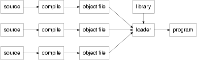

Introduction
============

The form of a C program
^^^^^^^^^^^^^^^^^^^^^^^
If you're used to the block-structured form of, say, Pascal, then at the outer level the layout of a C program may surprise you. If your experience lies in the FORTRAN camp you will find it closer to what you already know, but the inner level will look quite different. C has borrowed shamelessly from both kinds of language, and from a lot of other places too. The input from so many varied sources has spawned a language a bit like a cross-bred terrier: inelegant in places, but a tenacious brute that the family is fond of. Biologists refer to this phenomenon as ‘hybrid vigour’. They might also draw your attention to the ‘chimera’, an artificial crossbreed of creatures such as a sheep and a goat. If it gives wool and milk, fine, but it might equally well just bleat and stink!

At the coarsest level, an obvious feature is the multi-file structure of a program. The language permits separate compilation, where the parts of a complete program can be kept in one or more source files and compiled independently of each other. The idea is that the compilation process will produce files which can then be linked together using whatever link editor or loader that your system provides. The block structure of the Algol-like languages makes this harder by insisting that the whole program comes in one chunk, although there are usually ways of getting around it.

The reason for C's approach is historical and rather interesting. It is supposed to speed things up: the idea is that compiling a program into relocatable object code is slow and expensive in terms of resources; compiling is hard work. Using the loader to bind together a number of object code modules should simply be a matter of sorting out the absolute addresses of each item in the modules when combined into a complete program. This should be relatively inexpensive. The expansion of the idea to arrange for the loader to scan libraries of object modules, and select the ones that are needed, is an obvious one. The benefit is that if you change one small part of a program then the expense of recompiling all of it may be avoided; only the module that was affected has to be recompiled.

All, the same, it's true that the more work put on to the loader, the slower it becomes, in fact sometimes it can be the slowest and most resource consuming part of the whole procedure. It is possible that, for some systems, it would be quicker to recompile everything in one go than to have to use the loader: Ada has sometimes been quoted as an example of this effect occurring. For C, the work that has to be done by the loader is not large and the approach is a sensible one. Figure 1.1 shows the way that this works.

    Seperate Compilation

This technique is important in C, where it is common to find all but the smallest of programs constructed from a number of separate source files. Furthermore, the extensive use that C makes of libraries means that even trivial programs pass through the loader, although that might not be obvious at the first glance or to the newcomer.

Functions
^^^^^^^^^
A C program is built up from a collection of items such as functions and what we could loosely call global variables. All of these things are given names at the point where they are defined in the program; the way that the names are used to access those items from a given place in the program is governed by rules. The rules are described in the Standard using the term linkage. For the moment we only need to concern ourselves with external linkage and no linkage. Items with external linkage are those that are accessible throughout the program (library functions are a good example); items with no linkage are also widely used but their accessibility is much more restricted. Variables used inside functions are usually ‘local’ to the function; they have no linkage. Although this book avoids the use of complicated terms like those where it can, sometimes there isn't a plainer way of saying things. Linkage is a term that you are going to become familiar with later. The only external linkage that we will see for a while will be when we are using functions.

Functions are C's equivalents of the functions and subroutines in FORTRAN, functions and procedures in Pascal and ALGOL. Neither BASIC in most of its simple mutations, nor COBOL has much like C's functions.

The idea of a function is, of course, to allow you to encapsulate one idea or operation, give it a name, then to call that operation from various parts of the rest of your program simply by using the name. The detail of what is going on is not immediately visible at the point of use, nor should it be. In well designed, properly structured programs, it should be possible to change the way that a function does its job (as long as the job itself doesn't change) with no effect on the rest of the program.

In a hosted environment there is one function whose name is special; it's the one called main. This function is the first one entered when your program starts running. In a freestanding environment the way that a program starts up is implementation defined; a term which means that although the Standard doesn't specify what must happen, the actual behaviour must be consistent and documented. When the program leaves the main function, the whole program comes to an end. Here's a simple program containing two functions:

A description of Example 1.1
^^^^^^^^^^^^^^^^^^^^^^^^^^^^

Some more programs
^^^^^^^^^^^^^^^^^^

Terminology
^^^^^^^^^^^

Summary
^^^^^^^

Exercises
^^^^^^^^^
