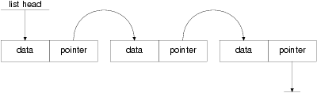
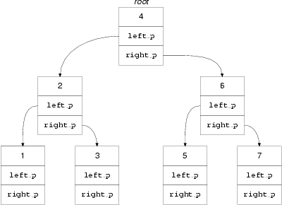

.. _structs:

Structures
==========

History
-------

The development of the early computer languages went either one
way or the other. COBOL concentrated on the structure of
data but not on arithmetic or algorithms, FORTRAN and Algol
leant the other way. Scientific users wanted to do numeric
work on relatively unstructured data (although arrays were soon found
to be indispensable) and commercial users needed only basic arithmetic
but knew that the key issue was the structure of
the data.

The ideas that have influenced C are a mixture of
the two schools; it has the structured control of flow
expected in a language of its age, and has also
made a start on data structures. So far we have
concentrated on the algorithmic aspects of the language and haven't
thought hard about data storage. Whilst it's true that arrays
fall into the general category of data structuring, they are
so simple, and so commonly in use, that they don't
deserve a chapter to themselves. Until now we have been
looking at a kind of block-structured FORTRAN.

The trend in the late 1980s and early '90s seems
to be towards integrating both the data and the algorithms;
it's then called Object-Oriented programming. There is no specific support
for that in C. C++ is a language based on
C that does offer support for Object-Oriented techniques, but it
is out of our scope to discuss it further.

For a large class of problems in computing, it is
the data and not the algorithms that are the most
interesting. If the initial design gets its data structures right,
the rest of the effort in putting a program together
is often quite small. However, you need help from the
language. If there is no support for structured data types
other than arrays, writing programs becomes both less convenient and
also more prone to errors. It is the job of
a good language to do more than just allow you
to do something; it must actively help as well.

C offers arrays, structures and unions as its contribution to
data structuring. They have proved to be entirely adequate for
most users' needs over the years and remain essentially unchanged
by the Standard.

Structures
----------

Arrays allow for a named collection of identical objects. This
is suitable for a number of tasks, but isn't really
very flexible. Most real data objects are complicated things with
an inherent structure that does not fit well on to
array style storage. Let's use a concrete example.

Imagine that the job is something to do with a
typesetting package. In this system, the individual characters have not
only their character values but also some additional attributes like
font and point size. The font doesn't affect the character
as such, but only the way that it is displayed:
this is the normal font, this is in italics and
this is in bold font. Point size is similar. It
describes the size of the characters when they are printed.
For example, the point size of this text increases now.
It goes back again now. If our characters have three
independent attributes, how can they be represented in a single
object?

With C it's easy. First work out how to represent
the individual attributes in the basic types. Let's assume that
we can still store the character itself in a char,
that the font can be encoded into a short (1
for regular, 2 italic, 3 bold etc.) and that the
point size will also fit a short. These are all
quite reasonable assumptions. Most systems only support a few tens
of fonts even if they are very sophisticated, and point
sizes are normally in the range 6 to the small
hundreds. Below 6 is almost invisible, above 50 is bigger
than the biggest newspaper banner headlines. So we have a
char and two shorts that are to be treated as
a single entity. Here's how to declare it in C.

.. code-block:: C

    struct wp_char{
          char wp_cval;
          short wp_font;
          short wp_psize;
    };

That effectively declares a new type of object which can
be used in your program. The whole thing is introduced
by the struct keyword, which is followed by an optional
identifier known as the tag, wp_char in this case. The
tag only serves the purpose of giving a name to
this type of structure and allows us to refer to
the type later on. After a declaration like the one
just seen, the tag can be used like this:

.. code-block:: C

    struct wp_char x, y;

That defines two variables called x and y just as
it would have done if the definition had been

.. code-block:: C

    int x, y;

but of course in the first example the variables are
of type struct wp_char, and in the second their type
is int. The tag is a name for the new
type that we have introduced.

It's worth remembering that structure tags can safely be used
as ordinary identifiers as well. They only mean something special
when they are preceded by the keyword struct. It is
quite common to see a structured object being defined with
the same name as its structure tag.

.. code-block:: C

    struct wp_char wp_char;

That defines a variable called wp_char of type struct wp_char.
This is described by saying that structure tags have their
own ‘name space’ and cannot collide with other names. We'll
investigate tags some more in the discussion of ‘incomplete types’.

Variables can also be defined immediately following a structure declaration.

.. code-block:: C

    struct wp_char{
          char wp_cval;
          short wp_font;
          short wp_psize;
    }v1;

    struct wp_char v2;

We now have two variables, v1 and v2. If all
the necessary objects are defined at the end of the
structure declaration, the way that v1 was, then the tag
becomes unneccessary (except if it is needed later for use
with sizeof and in casts) and is often not present.

The two variables are structured objects, each containing three separate
members called wp_cval, wp_font and wp_psize. To access the individual
members of the structures, the ‘dot’ operator is used:

.. code-block:: C

    v1.wp_cval = 'x';
    v1.wp_font = 1;
    v1.wp_psize = 10;

    v2 = v1;

The individual members of v1 are initialized to suitable values,
then the whole of v1 is copied into v2 in an assignment.

In fact the only operation permitted on whole structures is
assignment: they can be assigned to each other, passed as
arguments to functions and returned by functions. However, it is
not a very efficient operation to copy structures and most
programs avoid structure copying by manipulating pointers to structures instead.
It is generally quicker to copy pointers around than structures.
A surprising omission from the language is the facility to
compare structures for equality, but there is a good reason
for this which will be mentioned shortly.

Here is an example using an array of structures like
the one before. A function is used to read characters
from the program's standard input and return an appropriately initialized
structure. When a newline has been read or the array
is full, the structures are sorted into order depending on
the character value, and then printed out.

.. literalinclude:: ../src/example6.1/src/example6.1.c
   :language: c
   :linenos:

Example 6.1

Once it is possible to declare structures it seems pretty
natural to declare arrays of them, use them as members
of other structures and so on. In fact the only
restriction is that a structure cannot contain an example of
itself as a member—in which case its size would be
an interesting concept for philosophers to debate, but hardly useful
to a C programmer.

6.2.1. Pointers and structures

If what the last paragraph says is true—that it is
more common to use pointers to structures than to use
the structures directly—we need to know how to do it.
Declaring pointers is easy of course:

.. code-block:: C

    struct wp_char *wp_p;

gives us one straight away. But how do we access
the members of the structure? One way might be to
look through the pointer to get the whole structure, then
select the member:

.. code-block:: C

    /* get the structure, then select a member */
    (*wp_p).wp_cval

that would certainly work (the parentheses are there because .
has a higher precedence than \*). It's not an easy
notation to work with though, so C introduces a new
operator to clean things up; it is usually known as
the ‘pointing-to’ operator. Here it is being used:

.. code-block:: C

    /* the wp_cval in the structure wp_p points to */
    wp_p->wp_cval = 'x';

and although it might not look a lot easier than
its alternative, it pays off when the structure contains pointers,
as in a linked list. The pointing-to syntax is much
easier if you want to follow two or three stages
down the links of a linked list. If you haven't
come across linked lists before, you're going to learn a
lot more than just the use of structures before this
chapter finishes!

If the thing on the left of the . or ->
operator is qualified (with const or volatile) then the
result is also has those qualifiers associated with it. Here
it is, illustrated with pointers; when the pointer points to
a qualified type the result that you get is also qualified:

.. code-block:: C

    #include <stdio.h>
    #include <stdlib.h>

    struct somestruct{
          int i;
    };

    main(){
          struct somestruct *ssp, s_item;
          const struct somestruct *cssp;

          s_item.i = 1;   /* fine */
          ssp = &s_item;
          ssp->i += 2;    /* fine */
          cssp = &s_item;
          cssp->i = 0;    /* not permitted - cssp points to const objects */

          exit(EXIT_SUCCESS);
    }

Not all compiler writers seem to have noticed that requirement—the
compiler that we used to test the last example failed
to warn that the final assignment violated a constraint.

Here
is the Example 6.1 rewritten using pointers, and with the
input function infun changed to accept a pointer to a
structure rather than returning one. This is much more likely
to be what would be seen in practice.

(It is fair to say that, for a really efficient
implementation, even the copying of structures would probably be dropped,
especially if they were large. Instead, an array of pointers
would be used, and the pointers exchanged until the sorted
data could be found by traversing the pointer array in
index order. That would complicate things too much for a
simple example.)

.. literalinclude:: ../src/example6.2/src/example6.2.c
   :language: c
   :linenos:

Example 6.2

The next issue is to consider what a structure looks
like in terms of storage layout. It's best not to
worry about this too much, but it is sometimes useful
if you have to use C to access record-structured data
written by other programs. The wp_char structure will be allocated
storage as shown in Figure 6.1.
Diagram showing the layout
of the values in 'struct wp_char', with boxes containing 'wp_cval',
an empty space of padding, 'wp_font' and 'wp_psize'.

.. figure:: _static/6.1.png
    :align: center
    :alt: Storage Layout of a Structure
    :figclass: align-center

    Figure 6.1. Storage Layout of a Structure

The diagram assumes a number of things: that a char
takes 1 byte of storage; that a short needs 2
bytes; and that shorts must be aligned on even byte
addresses in this architecture. As a result the structure contains
an unnamed 1-byte member inserted by the compiler for architectural
reasons. Such addressing restrictions are quite common and can often
result in structures containing ‘holes’.

The Standard makes some guarantees about the layout of structures
and unions:

    Members of a structure are allocated within the structure in
    the order of their appearance in the declaration and have
    ascending addresses.

    There must not be any padding in front of the first member.

    The address of a structure is the same as the
    address of its first member, provided that the appropriate cast
    is used. Given the previous declaration of struct wp_char, if
    item is of type struct wp_char, then (char \*)item == &item.wp_cval.

    Bit fields (see Section 6.4) don't actually have addresses, but
    are conceptually packed into units which obey the rules above.

6.2.2. Linked lists and other structures

The combination of structures and pointers opens up a lot
of interesting possibilities. This is not a textbook on complex
linked data structures, but it will go on to describe
two very common examples of the breed: linked lists and
trees. Both have a feature in common: they consist of
structures containing pointers to other structures, all the structures typically
being of the same type. Figure 6.2 shows a picture
of a linked list.
Diagram showing a linked list of
three items, with a pointer labelled 'list head' pointing to
the first item, and each item containing a 'data' value
and a 'pointer' value which points to the next item
(the last pointer is null).

    Figure 6.2. List linked by pointers

The sort of declaration needed for that is this:

.. code-block:: C

    struct list_ele{
          int data;       /* or whatever you like here */
          struct list_ele *ele_p;
    };

Now, at first glance, it seems to contain itself—which is
forbidden—but in fact it only contains a pointer to itself.
How come the pointer declaration is allowed? Well, by the
time the compiler reaches the pointer declaration it already knows
that there is such a thing as a struct list_ele
so the declaration is permitted. In fact, it is possible
to make a incomplete declaration of a structure by saying

.. code-block:: C

    struct list_ele;

at some point before the full declaration. A declaration like
that declares an incomplete type. This will allow the declaration
of pointers before the full declaration is seen. It is
also important in the case of cross-referencing structures where each
must contain a pointer to the other, as shown in the following example.

.. literalinclude:: ../src/example6.3/src/example6.3.c
   :language: c
   :linenos:

Example 6.3

This illustrates the need for incomplete types. It also illustrates
an important thing about the names of structure members: they
inhabit a name-space per structure, so element names can be
the same in different structures without causing any problems.

Incomplete types may only be used where the size of
the structure isn't needed yet. A full declaration must have
been given by the time that the size is used.
The later full declaration mustn't be in an inner block
because then it becomes a new declaration of a different
structure.

.. literalinclude:: ../src/example6.4/src/example6.4.c
   :language: c
   :linenos:

Example 6.4

There's one thing to watch out for: you get a
incomplete type of a structure simply by mentioning its name!
That means that this works:

.. code-block:: C

    struct abc{ struct xyz *p;};
          /* the incomplete type 'struct xyz' now declared */
    struct xyz{ struct abc *p;};
          /* the incomplete type is now completed */

There's a horrible danger in the last example, though, as
this shows:

.. code-block:: C

    struct xyz{float x;} var1;

    main(){
          struct abc{ struct xyz *p;} var2;

          /* AAAGH - struct xyz REDECLARED */
          struct xyz{ struct abc *p;} var3;
    }

The result is that var2.p can hold the address of
var1, but emphatically not the address of var3 which is
of a different type! It can be fixed (assuming that
it's not what you wanted) like this:

.. code-block:: C

    struct xyz{float x;} var1;

    main(){
          struct xyz;     /* new incomplete type 'struct xyz' */
          struct abc{ struct xyz *p;} var2;
          struct xyz{ struct abc *p;} var3;
    }

The type of a structure or union is completed when
the closing } of its declaration is seen; it must
contain at least one member or the behaviour is undefined.

The other principal way to get incomplete types is to
declare arrays without specifying their size—their type is incomplete until
a later declaration provides the missing information:

.. code-block:: C

    int ar[];       /* incomplete type */
    int ar[5];      /* completes the type */

If you try that out, it will only work if
the declarations are outside any blocks (external declarations), but that's
for other reasons.

Back to the linked list. There were three elements linked
into the list, which could have been built like this:

.. literalinclude:: ../src/example6.5/src/example6.5.c
   :language: c
   :linenos:

Example 6.5

and the contents of the list can be printed in
two ways. The array can be traversed in order of
index, or the pointers can be used as in the
following example.

.. literalinclude:: ../src/example6.6/src/example6.6.c
   :language: c
   :linenos:

Example 6.6

It's the way that the pointers are followed which makes
the example interesting. Notice how the pointer in each element
is used to refer to the next one, until the
pointer whose value is 0 is found. That value causes
the while loop to stop. Of course the pointers can
be arranged in any order at all, which is what
makes the list such a flexible structure. Here is a
function which could be included as part of the last
program to sort the linked list into numeric order of
its data fields. It rearranges the pointers so that the
list, when traversed in pointer sequence, is found to be
in order. It is important to note that the data
itself is not copied. The function must return a pointer
to the head of the list, because that is not
necessarily at ar[0] any more.

.. literalinclude:: ../src/example6.7/src/example6.7.c
   :language: c
   :linenos:

Example 6.7

Expressions such as thisp->pointer->pointer are commonplace in list processing. It's
worth making sure that you understand it; the notation emphasizes
the way that links are followed.

6.2.3. Trees

Another very popular data structure is the tree. It's actually
a linked list with branches; a common type is the
binary tree which has elements (nodes) looking like this:

.. code-block:: C

    struct tree_node{
          int data;
          struct tree_node *left_p, *right_p;
    };

For historical and essentially irrelevant reasons, trees in computer science
work upside down. They have their root node at the
top and their branches spread out downwards. In Figure 6.3,
the ‘data’ members of the nodes are replaced by values
which will be used in the discussion that follows.
A
tree structure, made up of 7 items, each of which
is labelled with a different number. Each item has two
pointer values, labelled 'left_p' and 'right_p', which point to child
items. One item is labelled 'root' and isn't a child
of any of the other items.

    Figure 6.3. A tree

Trees may not seem very exciting if your main interest
lies in routine character handling and processing, but they are
extremely important to the designers of databases, compilers and other
complex tools.

The advantage of a tree is that, if
it is properly arranged, the layout of the data can
support binary searching very simply. It is always possible to
add new nodes to a tree at the appropriate place
and a tree is basically a flexible and useful data
structure.

Look at Figure 6.3. The tree is carefully constructed so
that it can be searched to find whether a given
value can be found in the data portions of the
nodes. Let's say we want to find if a value
x is already present in the tree. The algorithm is this:

    Start at the root of the tree:

    if the tree is empty (no nodes)

        then return ‘failure’.

    else if the data in the current node is equal

            to the value being searched for

            then return ‘success’.

    else if the data in the current node is greater than the

            value being searched for

            then search the tree indicated by the left pointer

    else search the tree indicated by the right pointer.

Here it is in C:

.. literalinclude:: ../src/example6.8/src/example6.8.c
   :language: c
   :linenos:

Example 6.8

So that works fine. It is also interesting to note that,
given a value, it can always be inserted at the appropriate
point in the tree. The same search algorithm is used, but,
instead of giving up when it finds that the value is
not already in the tree, a new node is allocated by
malloc, and is hung on the tree at the very place
where the first null pointer was found. This is a mite
more complicated to do because of the problem of handling the
root pointer itself, and so a pointer to a pointer is
used. Read the example carefully; it is not likely that you
ever find anything more complicated than this in practice. If you
can understand it, there is not much that should worry you
about the vast majority of C language programs.

.. literalinclude:: ../src/example6.9/src/example6.9.c
   :language: c
   :linenos:

Example 6.9

Finally, the algorithm that allows you to walk along the tree
visiting all the nodes in order is beautiful. It is the
cleanest example of recursion that you are likely to see. Look
at it and work out what it does.

.. literalinclude:: ../src/example6.10/src/example6.10.c
   :language: c
   :linenos:

Example 6.10

Unions
------

Unions don't take long to explain. They are the same
as structures, except that, where you would have written struct
before, now you write union. Everything works the same way,
but with one big exception. In a structure, the members
are allocated separate consecutive chunks of storage. In a union,
every member is allocated the same piece of storage. What
would you use them for? Well, sometimes you want a
structure to contain different values of different types at different
times but to conserve space as much as possible. Using
a union, it's up to you to keep track of
whatever type you put into it and make sure that
you retrieve the right type at the right time. Here's
an example:

.. literalinclude:: ../src/example6.11/src/example6.11.c
   :language: c
   :linenos:

Example 6.11

If the example had, say, put a float into the
union and then extracted it as an int, a strange
value would have resulted. The two types are almost certainly
not only stored differently, but of different lengths. The int
retrieved would probably be the low-order bits of the machine
representation of a float, and might easily be made up
of part of the mantissa of the float plus a
piece of the exponent. The Standard says that if you
do this, the behaviour is implementation defined (not undefined). The
behaviour is defined by the Standard in one case: if
some of the members of a union are structures with
a ‘common initial sequence’ (the first members of each structure
have compatible type and in the case of bitfields are
the same length), and the union currently contains one of
them, then the common initial part of each can be
used interchangeably. Oh good.

The C compiler does no more than work out what
the biggest member in a union can be and allocates
enough storage (appropriately aligned if neccessary). In particular, no checking
is done to make sure that the right sort of
use is made of the members. That is your task,
and you'll soon find out if you get it wrong.
The members of a union all start at the same
address—there is guaranteed to be no padding in front of
any of them.

The most common way of remembering what is in a
union is to embed it in a structure, with another
member of the structure used to indicate the type of
thing currently in the union. Here is how it might
be used:

.. literalinclude:: ../src/example6.12/src/example6.12.c
   :language: c
   :linenos:

Example 6.12

That also demonstrates how the dot notation is used to
access structures or unions inside other structures or unions. Some
current C compilers allow you to miss bits out of
the names of embedded objects provided that they are not
ambiguous. In the example, such an unambiguous name would be
var_type.un_int and the compiler would work out what you meant.
None the less this is not permitted by the Standard.

It is because of unions that structures cannot be compared
for equality. The possibility that a structure might contain a
union makes it hard to compare such structures; the compiler
can't tell what the union currently contains and so wouldn't
know how to compare the structures. This sounds a bit
hard to swallow and isn't 100% true—most structures don't contain
unions—but there is also a philosophical issue at stake about
just what is meant by ‘equality’ when applied to structures.
Anyhow, the union business gives the Standard a good excuse
to avoid the issue by not supporting structure comparison.

Bitfields
---------

While we're on the subject of structures, we might as
well look at bitfields. They can only be declared inside
a structure or a union, and allow you to specify
some very small objects of a given number of bits
in length. Their usefulness is limited and they aren't seen
in many programs, but we'll deal with them anyway. This
example should help to make things clear:

.. literalinclude:: ../src/example6.13/src/example6.13.c
   :language: c
   :linenos:

Example 6.13

Each field is accessed and manipulated as if it were
an ordinary member of a structure. The keywords signed and
unsigned mean what you would expect, except that it is
interesting to note that a 1-bit signed field on a
two's complement machine can only take the values 0 or
-1. The declarations are permitted to include the const and
volatile qualifiers.

The main use of bitfields is either to allow tight
packing of data or to be able to specify the
fields within some externally produced data files. C gives no
guarantee of the ordering of fields within machine words, so
if you do use them for the latter reason, you
program will not only be non-portable, it will be compiler-dependent
too. The Standard says that fields are packed into ‘storage
units’, which are typically machine words. The packing order, and
whether or not a bitfield may cross a storage unit
boundary, are implementation defined. To force alignment to a storage
unit boundary, a zero width field is used before the
one that you want to have aligned.

Be careful using them. It can require a surprising amount
of run-time code to manipulate these things and you can
end up using more space than they save.

Bit fields do not have addresses—you can't have pointers to
them or arrays of them.

Enums
-----

These fall into the category of ‘half baked’. They aren't
proper enumerated types, as in Pascal, and only really serve
to help you reduce the number of #define statements in
your program. They look like this:

.. code-block:: C

    enum e_tag{
          a, b, c, d=20, e, f, g=20, h
    }var;

Just as with structures and unions, the e_tag is the
tag, and var is the definition of a variable.

The names declared inside the enumeration are constants with int
type. Their values are these:

.. code-block:: C

    a == 0
    b == 1
    c == 2
    d == 20
    e == 21
    f == 22
    g == 20
    h == 21

so you can see that, in the absence of anything
to the contrary, the values assigned start at zero and
increase. A specific value can be given if you want,
when the increase will continue one at a time afterwards;
the specific value must be an integral constant (see later)
that is representable in an int. It is possible for
more than one of the names to have the same value.

The only use for these things is to give a
better-scoped version of this:

.. code-block:: C

    #define a 0
    #define b 1
    /* and so on */

It's better scoped because the declaration of enumerations follows the
standard scope rules for C, whereas #define statements have file
scope.

Not that you are likely to care, but the Standard
states that enumeration types are of a type that is
compatible with an implementation-defined one of the integral types. So
what? For interest's sake here is an illustration:

.. code-block:: C

    enum ee{a,b,c}e_var, *ep;

The names a, b, and c all behave as if
they were int constants when you use them; e_var has
type enum ee and ep is a pointer to enum
ee. The compatibility requirement means that (amongst other implications) there
will be an integral type whose address can be assigned
to ep without violating the type-compatibility requirements for pointers.

Qualifiers and derived types
----------------------------

Arrays, structures and unions are ‘derived from’ (contain) other types;
none of them may be derived from incomplete types. This
means that a structure or union cannot contain an example
of itself, because its own type is incomplete until the
declaration is complete. Since a pointer to an incomplete type
is not itself an incomplete type, it can be used
in the derivation of arrays, structures and unions.

If any of the types that these things are derived
from are qualified with const or volatile, they do not
inherit that qualification. This means that if a structure contains
a const object, the structure itself is not qualified with
const and any non-const members can still be modified. This
is what you would expect. However, the Standard does says
that if any derived type contains a type that is
qualified with const (or recursively any inner type does) then
it is not modifiable—so a structure that contains a const
cannot be on the left-hand side of an assignment operator.

Initialization
--------------

Now that we have seen all of the data types supported
by C, we can look at the subject of initialization.
C allows ordinary variables, structures, unions and arrays to be
given initial values in their definitions. Old C had some
strange rules about this, reflecting an unwillingness by compiler writers
to work too hard. The Standard has rationalized this, and
now it is possible to initialize things as and when you want.

There are basically two sorts of initialization: at compile time,
and at run time. Which one you get depends on
the storage duration of the thing being initialized.

Objects with static duration are declared either outside functions, or
inside them with the keyword extern or static as part
of the declaration. These can only be initialized at compile
time.

Any other object has automatic duration, and can only be
initialized at run time. The two categories are mutually exclusive.

Although they are related, storage duration and linkage (see :ref:`functions`)
are different and should not be confused.

Compile-time initialization can only be done using constant expressions; run-time
initialization can be done using any expression at all. The
Old C restriction, that only simple variables (not arrays, structures
or unions) could be initialized at run time, has been lifted.

Constant expressions
~~~~~~~~~~~~~~~~~~~~

There are a number of places where constant expressions must
be used. The definition of what constitutes a constant expression
is relatively simple.

A constant expression is evaluated by the compiler, not at
run-time. It may be used anywhere that a constant may
be used. Unless it is part of the operand of
sizeof, it may not contain any assignment, increment or decrement
operations, function calls or comma operators; that may seem odd,
but it's because sizeof only needs to evaluate the type
of an expression, not its value.

If real numbers are evaluated at compile-time, then the Standard
insists that they are evaluated with at least as much
precision and range as will be used at run-time.

A more restricted form, called the integral constant expression exists.
This has integral type and only involves operands that are
integer constants, enumeration constants, character constants, sizeof expressions and real
constants that are the immediate operands of casts. Any cast
operators are only allowed to convert arithmetic types to integral
types. As with the previous note on sizeof expressions, since
they don't have to be evaluated, just their type determined,
no restrictions apply to their contents.

The arithmetic constant expression is like the integral constant expression,
but allows real constants to be used and restricts the
use of casts to converting one arithmetic type to another.

The address constant is a pointer to an object that
has static storage duration or a pointer to a function.
You can get these by using the & operator or
through the usual conversions of array and function names into
pointers when they are used in expressions. The operators [],
., ->, & (address of) and * (pointer dereference) as
well as casts of pointers can all be used in
the expression as long as they don't involve accessing the
value of any object.

More initialization
~~~~~~~~~~~~~~~~~~~

The various types of constants are permitted in various places;
integral constant expressions are particularly important because they are the
only type of expression that may be used to specify
the size of arrays and the values in case statement
prefixes. The types of constants that are permitted in initializer
expressions are less restricted; you are allowed to use: arithmetic
constant expressions; null pointer or address constants; an address constant
for an object plus or minus an integral constant expression.
Of course it depends on the type of thing being
initialized whether or not a particular type of constant expression
is appropriate.

Here is an example using several initialized variables:

.. literalinclude:: ../src/example6.14/src/example6.14.c
   :language: c
   :linenos:

Example 6.14

Initializing ordinary variables is easy: put = expression after the
variable name in a declaration, and the variable is initialized
to the value of the expression. As with all objects,
whether you can use any expression, or just a constant
expression, depends on its storage duration.

Initializing arrays is easy
for one-dimensional arrays. Just put a list of the values
you want, separated by commas, inside curly brackets. The example
shows how to do it. If you don't give a
size for the array, then the number of initializers will
determine the size. If you do give a size, then
there must be at most that many initializers in the
list. Too many is an error, too few will just
initialize the first elements of the array.

You could build up a string like this:

.. code-block:: C

    char str[] = {'h', 'e', 'l', 'l', 'o', 0};

but because it is so often necessary to do that,
it is also permitted to use a quoted string literal
to initialize an array of chars:

.. code-block:: C

    char str[] = "hello";

In that case, the null at the end of the
string will also be included if there is room, or
if no size was specified. Here are examples:

.. code-block:: C

    /* no room for the null */
    char str[5] = "hello";

    /* room for the null */
    char str[6] = "hello";

The example program used string literals for a different purpose:
there they were being used to initialize an array of
character pointers; a very different prospect.

For structures that have automatic duration, an expression of the
right type can be used to initialize them, or else
a bracketed list of constant expressions must be used:

.. literalinclude:: ../src/example6.15/src/example6.15.c
   :language: c
   :linenos:

Example 6.15

Only the first member of a union can be initialized.

If a structure or union contains unnamed members, whether unnamed
bitfields or padding for alignment, they are ignored in the
initialization process; they don't have to be counted when you
provide the initializers for the real members of the structure.

For objects that contain sub-objects within them, there are two
ways of writing the initializer. It can be written out
with an initializer for each member:

.. literalinclude:: ../src/example6.16/src/example6.16.c
   :language: c
   :linenos:

Example 6.16

which will assign 1 to x[0].a, 2 to x[0].e.c, a
to x[0].e.d and 3 to x[1].a and so on.

It is much safer to use internal braces to show
what you mean, or one missed value will cause havoc.

.. literalinclude:: ../src/example6.17/src/example6.17.c
   :language: c
   :linenos:

Example 6.17

Always fully bracket initializers—that is much the safest thing to
do.

It is the same for arrays as for structures:

.. literalinclude:: ../src/example6.17/src/example6.17.c
   :language: c
   :linenos:

Example 6.18

that gives full initialization to the first three rows of y.
The fourth row, y[3], is uninitialized.

Unless they have
an explicit initializer, all objects with static duration are given
implicit initializers—the effect is as if the constant 0 had
been assigned to their components. This is in fact widely
used—it is an assumption made by most C programs that
external objects and internal static objects start with the value
zero.

Initialization of objects with automatic duration is only guaranteed if
their compound statement is entered ‘at the top’. Jumping into
the middle of one may result in the initialization not
happening—this is often undesirable and should be avoided. It is
explicitly noted by the Standard with regard to switch statements,
where providing initializers in declarations cannot be of any use;
this is because a declaration is not linguistically a ‘statement’
and only statements may be labelled. As a result it
is not possible for initializers in switch statements ever to
be executed, because the entry to the block containing them
must be below the declarations!

A declaration inside a function (block scope) can, using various
techniques outlined in :ref:`functions` and :ref:`specialized`, be made
to refer to an object that has either external or
internal linkage. If you've managed to do that, and it's
not likely to happen by accident, then you can't initialize
the object as part of that declaration. Here is one
way of trying it:

.. code-block:: C

    int x;                        /* external linkage */
    main(){
          extern int x = 5;       /* forbidden */
    }

Our test compiler didn't notice that one, either.

Summary
-------

You now understand structures and unions. Bitfields and enumeration types really
are not very important and you could manage quite well without
them.

It is hard to emphasize how important is the use of
structures, pointers and malloc in serious programs. If you aren't familiar
with the use of structured data in the form of lists,
trees and so on, get a good book now. Better still,
try to enrol on a good course. Except in very specialized
applications, it is usually the ability to structure data well, not
the ability to write complicated algorithms, that makes it possible to
construct clean, small and maintainable programs. Experienced software designers often say
that once the right structure of the data has been determined,
the rest is ‘simple’.

Undoubtedly, one of the reasons for the popularity of C among
experienced software specialists is the freedom that it gives in the
structuring of data, without sacrificing speed.

Initialization should not be overlooked. Although simple in concept, it is
surprising how inconvenient many other languages make this. The ludicrous extreme
is to insist on the use of assignment statements; C has
a practical and convenient approach. If the concept of ‘fully bracketed
initializers’ seems a bit unpleasant, don't worry. It is rare that
you have to do it in practice; all that you need
is to know how to do simple initialization and to know
a book that describes the more complex initialization. To get the
full low-down read the Standard, which is uncharacteristically penetrable when it
discusses the matter; verging at times on lucidity.

Exercises
---------

Exercise 6.1. What is the declaration of an untagged structure containing
two ints called a and b?

Exercise 6.2. Why is such a declaration of limited use?

Exercise 6.3. What would the structure look like with a tag
of int_struc and two variables called x and y of the
structure type being defined?

Exercise 6.4. How would you declare a third variable later, with
the the same type as x and y but called z?

Exercise 6.5. Assuming that p is the right type of pointer,
how would you make it point to z and then set
z.a to zero, using the pointer?

Exercise 6.6. What are the two ways of declaring a structure
with incomplete type?

Exercise 6.7. What is unusual about a string "like this" when
it's used to initialize a character array?

Exercise 6.8. What if it initializes a char \*?

Exercise 6.9. Find out what a doubly linked list is. Reimplement
the linked list example using one. Is it any easier to
insert and delete elements in a doubly linked list?
