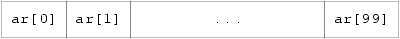
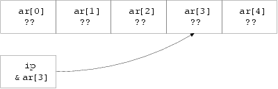
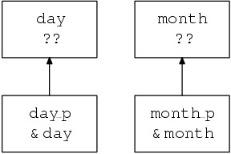
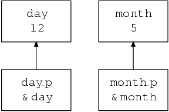

Arrays & pointers
=================

Opening shots
^^^^^^^^^^^^^

So why is this important?
~~~~~~~~~~~~~~~~~~~~~~~~~

The arithmetic data types and operators of C are interesting
but hardly rivetting. They show, collectively, a certain imagination and
spirit that has stamped C with a special flavour, but
they form the sauce, not the meat, of this particular
dish. For most users, it's functions and the parts
of the language covered in this chapter that provide the
real feel of C.

For the new reader, this is the part of the
language that causes the biggest problems. Most beginners with C
are at least familiar with the use of arithmetic, functions
and arrays; those are not the problem areas. The difficulties
arise when we get on to the structured types (structures
and unions), and the way that C just wouldn't
be C without the use of pointers.

Pointers aren't a feature that you can choose to
ignore. They're used everywhere; their influence affects the whole
language and must be the single most noticeable feature of
all but the simplest C programs. If you think that
this is one of the bits you can skip because
it's hard and doesn't look too important, you
are wrong! Most of the examples used so far in
this book have had pointers used in them (although not
obviously), so you might as well accept the inevitable and
learn how to use them properly.

The most natural way to introduce the use of pointers
is by looking into arrays first. C intertwines arrays and
pointers so closely that they are hard to separate. Since
you are expected to be familiar with the use of
arrays, their treatment will be brief and aimed at using
them to illustrate the use of pointers when they are
seen later.

Effect of the Standard
~~~~~~~~~~~~~~~~~~~~~~

The new Standard has left very little mark on the
contents of this chapter; a lot of it would be
nearly word for word the same even if it only
talked about Old C. The inference to be drawn is
that nothing was wrong with the old version of the
language, and that there was nothing to be gained by
fixing what wasn't broken. This may be received with
some relief by those readers who already knew this part
of the old language and who, like the Committee, felt
that it was good enough to leave alone.

Even so, the introduction of qualified types by the Standard
does add some complexity to this chapter. The rules about
exactly how the various arithmetic and relational operators work when
they are applied to pointers have been clarified, which adds
bulk to the text but has not changed things substantially.
In the early examples we do not pay a lot
of attention to them, but after that they are introduced
gradually and where appropriate.

Arrays
^^^^^^

Like other languages, C uses arrays as a way of
describing a collection of variables with identical properties. The group
has a single name for all of the members, with
the individual members being selected by an index. Here's
an array being declared:

.. code-block:: C

    double ar[100];

The name of the array is ar and its members
are accessed as ar[0] through to ar[99] inclusive
, as Figure 5.1 shows.

Diagram showing an array consisting of elements labelled 'ar[0]',
'ar[1]', etc., up to 'ar[99]'.

    Figure 5.1. 100 element array

Each of the hundred members is a separate variable whose
type is double. Without exception, all arrays in C are
numbered from 0 up to one less than the bound
given in the declaration. This is a prime cause of
surprise to beginners—watch out for it. For simple examples
of the use of arrays, look back at earlier chapters
where several problems are solved with their help.

One important point about array declarations is that they don't
permit the use of varying subscripts. The numbers given
must be constant expressions which can be evaluated at compile
time, not run time. For example, this function incorrectly tries
to use its argument in the size of an array declaration:

.. code-block:: C

    f(int x){
          char var_sized_array[x];        /* FORBIDDEN */
    }

It's forbidden because the value of x is unknown
when the program is compiled; it's a run-time,
not a compile-time, value.

To tell the truth, it would be easy to support
arrays whose first dimension is variable, but neither Old C
nor the Standard permits it, although we do know of
one Very Old C compiler that used to do it.

Multidimensional arrays
~~~~~~~~~~~~~~~~~~~~~~~

Multidimensional arrays can be declared like this:

.. code-block:: C

    int three_dee[5][4][2];
    int t_d[2][3]

The use of the brackets gives a clue to what
is going on. If you refer to the precedence table
given in Section 2.8.3 (Table 2.9), you
'll see that [] associates left to right and that, as
a result, the first declaration gives us a five-element
array called three_dee. The members of that array are
each a four element array whose members are an array
of two ints. We have declared arrays of arrays, as
Figure 5.2 shows for two dimensions.

Diagram showing a two dimensional array, with the 'outer' array
having two elements labelled 't_d[0]' and 't_d[1]',
each with three elements within it, labelled 't_d[0][0]', etc.

    Figure 5.2. Two-dimensional array, showing layout

In the diagram, you will notice that t_d[0]
is one element, immediately followed by t_d[1] (there
is no break). It so happens that both of those
elements are themselves arrays of three integers. Because of C's
storage layout rules, t_d[1][0] is immediately
after t_d[0][2]. It would be possible (but
very poor practice) to access t_d[1][0] by
making use of the lack of array-bound checking in
C, and to use the expression t_d[0][3].
That is not recommended—apart from anything else, if the
declaration of t_d ever changes, then the results will
be likely to surprise you.

That's all very well, but does it really matter
in practice? Not much it's true; but it is
interesting to note that in terms of actual machine storage
layout the rightmost subscript ‘varies fastest’. This has an impact
when arrays are accessed via pointers. Otherwise, they can be
used just as would be expected; expressions like these are
quite in order:

.. code-block:: C

    three_dee[1][3][1] = 0;
    three_dee[4][3][1] += 2;

The second of those is interesting for two reasons. First,
it accesses the very last member of the entire array—although
the subscripts were declared to be [5][4][2],
the highest usable subscript is always one less than the
one used in the declaration. Second, it shows where the
combined assignment operators are a real blessing. For the experienced
C programmer it is much easier to tell that only
one array member is being accessed, and that it is
being incremented by two. Other languages would have to express
it like this:

.. code-block:: C

    three_dee[4][3][1] = three_dee[4][3][1] + 2;

It takes a conscious effort to check that the same
array member is being referenced on both sides of the
assignment. It makes thing easier for the compiler too: there
is only one array indexing calculation to do, and this
is likely to result in shorter, faster code. (Of course
a clever compiler would notice that the left- and right-hand
sides look alike and would be able to generate
equally efficient code—but not all compilers are clever and
there are lots of special cases where even clever compilers
are unable to make use of the information.)

It may be of interest to know that although C
offers support for multidimensional arrays, they aren't particularly common
to see in practice. One-dimensional arrays are present in
most programs, if for no other reason than that's
what strings are. Two dimensional arrays are seen occasionally, and
arrays of higher order than that are most uncommon. One
of the reasons is that the array is a rather
inflexible data structure, and the ease of building and manipulating
other types of data structures in C means that they
tend to replace arrays in the more advanced programs. We
will see more of this when we look at pointers.

Pointers
^^^^^^^^

Using pointers is a bit like riding a bicycle. Just
when you think that you'll never understand them—suddenly
you do! Once learned the trick is hard to forget.
There's no real magic to pointers, and a lot
of readers will already be familiar with their use. The
only peculiarity of C is how heavily it relies on
the use of pointers, compared with other languages, and the
relatively permissive view of what you can do with them.

Declaring pointers
~~~~~~~~~~~~~~~~~~

Of course, just like other variables, you have to declare
pointers before you can use them. Pointer declarations look much
like other declarations: but don't be misled. When pointers
are declared, the keyword at the beginning (c int, char
and so on) declares the type of variable that the
pointer will point to. The pointer itself is not of
that type, it is of type pointer to that type.
A given pointer only points to one particular type, not
to all possible types. Here's the declaration of an
array and a pointer:

.. code-block:: C

    int ar[5], *ip;

We now have an array and a pointer (see Figure
5.3):

Diagram showing an array with four elements (labelled 'ar[0]'
to 'ar[4]') and a pointer called 'ip' which does
not currently have any connection to the array.

.. figure:: _static/
    :align: center
    :alt: An array and a pointer
    :figclass: align-center

    Figure 5.3. An array and a pointer

The \* in front of ip in the declaration shows that
it is a pointer, not an ordinary variable. It is
of type pointer to int, and can only be used
to refer to variables of type int. It's still
uninitialized, so to do anything useful with it, it has
to be made to point to something. You can't
just stick some integer value into it, because integer values
have the type int, not pointer to int, which is
what we want. (In any case, what would it mean
if this fragment were valid:

.. code-block:: C

    ip = 6;

What would ip be pointing to? In fact it could
be construed to have a number of meanings, but the
simple fact is that, in C, that sort of thing is just wrong.)

Here is the right way to initialize a pointer:

.. code-block:: C

    int ar[5], *ip;
    ip = &ar[3];

In that example, the pointer is made to point to
the member of the array ar whose index is 3,
i.e. the fourth member. This is important. You can
assign values to pointers just like ordinary variables; the difference
is simply in what the value means. The values of
the variables that we have now are shown in Figure
5.4 (?? means uninitialized).

Diagram showing an array with four elements (labelled 'ar[0]'
to 'ar[4]') each of which has an undefined value,
and a pointer called 'ip' which contains the address of
'ar[3]'.

    Figure 5.4. Array and initialized pointer

You can see that the variable ip has the value
of the expression &ar[3]. The arrow indicates that, when
used as a pointer, ip points to the variable ar[3].

What is this new unary &? It is usually described as
the ‘address-of’ operator, since on many systems the pointer
will hold the store address of the thing that it
points to. If you understand what addresses are, then you
will probably have more trouble than those who don't:
thinking about pointers as if they were addresses generally leads
to grief. What seems a perfectly reasonable address manipulation on
processor X can almost always be shown to be impossible
on manufacturer Y's washing machine controller which uses 17-bit
addressing when it's on the spin cycle, and
reverses the order of odd and even bits when it's
out of bleach. (Admittedly, it's unlikely that anyone
could get C to work an an architecture like that.
But you should see some of the ones it does
work on; they aren't much better.)

We will continue to use the term ‘address of’ though,
because to invent a different one would be even worse.

Applying the & operator to an operand returns a pointer to the operand:

.. code-block:: C

    int i;
    float f;
          /* '&i' would be of type pointer to int */
          /* '&f' would be of type pointer to float */

In each case the pointer would point to the object
named in the expression.

A pointer is only useful if there's some way
of getting at the thing that it points to; C
uses the unary \* operator for this job. If p is
of type ‘pointer to something’, then \*p refers to the
thing that is being pointed to. For example, to access
the variable x via the pointer p, this would work:

.. literalinclude:: ../src/example5.1/src/example5.1.c
   :language: c
   :linenos:

Example 5.1

You might be interested to note that, since & takes the
address of an object, returning a pointer to it, and
since \* means ‘the thing pointed to by the pointer’, the
& and \* in the combination \*& effectively cancel each other out. (But
be careful. Some things, constants for example, don't have
addresses and the & operator cannot be applied to them; &1.5
is not a pointer to anything, it's an
error.) It's also interesting to see that C is
one of the few languages that allows an expression on
the left-hand side of an assignment operator. Look back
at the example: the expression \*p occurs twice in that
position, and then the amazing (\*p)++; statement. That last one
is a great puzzle to most beginners—even if you
've managed to wrap your mind around the concept that
\*p = 0 writes zero into the thing pointed to by
p, and that \*p += 1 adds one to where p
points, it still seems a bit much to apply the ++ operator to \*p.

The precedence of (\*p)++ deserves some thought. It will be
given more later, but for the moment let's work
out what happens. The brackets ensure that the \* applies to
p, so what we have is ‘post-increment the thing
pointed to by p’. Looking at Table 2.9, it
turns out that ++ and \* have equal precedence, but they associate
right to left; in other words, without the brackets, the
implied operation would have been \*(p++), whatever that would mean.
Later on you'll be more used to it—for
the moment, we'll be careful with brackets to show
the way that those expressions work.

So, provided that a pointer holds the address of something,
the notation \*pointer is equivalent to giving the name of
the something directly. What benefit do we get from all
this? Well, straight away it gets round the call-by-value
restriction of functions. Imagine a function that has to return,
say, two integers representing a month and a day within
that month. The function has some (unspecified) way of determining
these values; the hard thing to do is to return
two separate values. Here's a skeleton of the way that it can be done:

.. literalinclude:: ../src/example5.2/src/example5.2.c
   :language: c
   :linenos:

Example 5.2

Notice carefully the advance declaration of date showing that it
takes two arguments of type ‘pointer to int’. It returns
void, because the values are passed back via the pointers,
not the usual return value. The main function passes pointers
as arguments to date, which first uses the internal variables
day_ret and month_ret for its calculations, then takes
those values and assigns them to the places pointed to
by its arguments.

When date is called, the situation looks like Figure 5.5.
Diagram showing the variables 'day' and 'month' which have undefined
values, and the pointers 'day_p' and 'month_p' which
contain their addresses.

    Figure 5.5. Just as date is called

The arguments have been passed to date, but in main,
day and month are uninitialized. When date reaches the return
statement, the situation is as shown in Figure 5.6
(assuming that the values for day and month are 12
and 5 respectively).
Diagram showing the same variables as Figure 5.5, except
that the 'day' and 'month' now have the values '12' and '5' respectively.

    Figure 5.6. Just as date is about to return

One of the great benefits introduced by the new Standard
is that it allows the types of the arguments to
date to be declared in advance. A great favourite (and
disastrous) mistake in C is to forget that a function
expects pointers as its arguments, and to pass something else
instead. Imagine what would have happened if the call of
date above had read

.. code-block:: C

    date(day, month);

and no previous declaration of date had been visible. The
compiler would not have known that date expects pointers as
arguments, so it would pass the int values of day
and month as the arguments. On a large number of
computers, pointers and integers can be passed in the same
way, so the function would execute, then pass back its
return values by putting them into wherever day and month
would point if their contents were pointers. This is very
unlikely to give any sensible results, and in general causes
unexpected corruption of data elsewhere in the computer's store.
It can be extremely hard to track down!

Fortunately, by declaring date in advance, the compiler has enough
information to warn that a mistake has almost certainly been made.

Perhaps surprisingly, it isn't all that common to see
pointers used to give this call-by-reference functionality. In
the majority of cases, call-by-value and a single
return value are adequate. What is much more common is
to use pointers to ‘walk’ along arrays.

Arrays and pointers
~~~~~~~~~~~~~~~~~~~

Array elements are just like other variables: they have addresses.

.. code-block:: C

    int ar[20], *ip;

    ip = &ar[5];
    *ip = 0;        /* equivalent to ar[5] = 0; */

The address of ar[5] is put into ip, then
the place pointed to has zero assigned to it. By
itself, this isn't particularly exciting. What is interesting is
the way that pointer arithmetic works. Although it's simple,
it's one of the cornerstones of C.

Adding an integral value to a pointer results in another
pointer of the same type. Adding n gives a pointer
which points n elements further along an array than the
original pointer did. (Since n can be negative, subtraction is
obviously possible too.) In the example above, a statement of the form

.. code-block:: C

    *(ip+1) = 0;

would set ar[6] to zero, and so on. Again,
this is not obviously any improvement on ‘ordinary’ ways of
accessing an array, but the following is.

.. code-block:: C

    int ar[20], *ip;

    for(ip = &ar[0]; ip < &ar[20]; ip++)
          *ip = 0;

That example is a classic fragment of C. A pointer
is set to point to the start of an array,
then, while it still points inside the array, array elements
are accessed one by one, the pointer incrementing between each
one. The Standard endorses existing practice by guaranteeing that it's
permissible to use the address of ar[20] even
though no such element exists. This allows you to use
it for checks in loops like the one above. The
guarantee only extends to one element beyond the end of
an array and no further.

Why is the example better than indexing? Well, most arrays
are accessed sequentially. Very few programming examples actually make use
of the ‘random access’ feature of arrays. If you do
just want sequential access, using a pointer can give a
worthwhile improvement in speed. In terms of the underlying address
arithmetic, on most architectures it takes one multiplication and one
addition to access a one-dimensional array through a subscript.
Pointers require no arithmetic at all—they nearly always hold
the store address of the object that they refer to.
In the example above, the only arithmetic that has to
be done is in the for loop, where one comparison
and one addition are done each time round the loop.
The equivalent, using indexes, would be this:

.. code-block:: C

    int ar[20], i;
    for(i = 0; i < 20; i++)
          ar[i] = 0;

The same amount of arithmetic occurs in the loop statement,
but an extra address calculation has to be performed for
every array access.

Efficiency is not normally an important issue, but here it
can be. Loops often get traversed a substantial number of
times, and every microsecond saved in a big loop can
matter. It isn't always easy for even a smart
compiler to recognize that this is the sort of code
that could be ‘pointerized’ behind the scenes, and to convert
from indexing (what the programmer wrote) to actually use a
pointer in the generated code.

If you have found things easy so far, read on.
If not, it's a good idea to skip to
Section 5.3.3. What follows, while interesting, isn't
essential. It has been known to frighten even experienced C
programmers.

To be honest, C doesn't really ‘understand’ array indexing,
except in declarations. As far as the compiler is concerned,
an expression like x[n] is translated into \*(x+n)
and use made of the fact that an array name
is converted into a pointer to the array's first
element whenever the name occurs in an expression. That's
why, amongst other things, array elements count from zero: if
x is an array name, then in an expression, x
is equivalent to &x[0], i.e. a pointer to
the first element of the array. So, since \*(&x[0])
uses the pointer to get to x[0], \*(&x[0] + 5)
is the same as \*(x + 5) which is the
same as x[5]. A curiosity springs out of all
this. If x[5] is translated into \*(x + 5), and
the expression x + 5 gives the same result as 5 + x
(it does), then 5[x] should give the identical
result to x[5]! If you don't believe that,
here is a program that compiles and runs successfully:

.. literalinclude:: ../src/example5.3/src/example5.3.c
   :language: c
   :linenos:

Example 5.3

Summary ::

    Arrays always index from zero—end of story.
    There are no multidimensional arrays; you use arrays of arrays instead.
    Pointers point to things; pointers to different types are themselves different types. They have nothing in common with each other or any other types in C; there are no automatic conversions between pointers and other types.
    Pointers can be used to simulate ‘call by reference’ to functions, but it takes a little work to do it.
    Incrementing or adding something to a pointer can be used to step along arrays.
    To facilitate array access by incrementing pointers, the Standard guarantees that in an n element array, although element n does not exist, use of its address is not an error—the valid range of addresses for an array declared as int ar[N] is &ar[0] through to &ar[N]. You must not try to access this last pseudo-element.

Qualified types
~~~~~~~~~~~~~~~

If you are confident that you have got a good
grasp of the basic declaration and use of pointers we
can continue. If not, it's important to go back
over the previous material and make sure that there is
nothing in it that you still find obscure; although what
comes next looks more complicated than it really is, there's
no need to make it worse by starting unprepared.

The Standard introduces two things called type qualifiers, neither of
which were in Old C. They can be applied to
any declared type to modify its behaviour—hence the term
‘qualifier’—and although one of them can be ignored for
the moment (the one named volatile), the other, const, cannot.

If a declaration is prefixed with the keyword const, then
the thing that is declared is announced to the world
as being constant. You must not attempt to modify (change
the value of) const objects, or you get undefined behaviour.
Unless you have used some very dirty tricks, the compiler
will know that the thing you are trying to modify
is constant, so it can warn you.

There are two benefits in being able to declare things
to be const. ::

    It documents the fact that the thing is unmodifiable and the compiler helps to check. This is especially reassuring in the case of functions which take pointers as arguments. If the declaration of a function shows that the arguments are pointers to constant objects, then you know that the function is not allowed to change them through the pointers.
    If the compiler knows that things are constant, it can often do increased amounts of optimization or generate better code.

Of course, constants are not much use unless you can
assign an initial value to them. We won't go
into the rules about initialization here (they are in Chapter 6),
but for the moment just note that any declaration
can also assign the value of a constant expression to
the thing being declared. Here are some example declarations involving
const:

.. code-block:: C

    const int x = 1;        /* x is constant */
    const float f = 3.5;    /* f is constant */
    const char y[10];       /* y is an array of 10 const ints */
                            /* don't think about initializing it yet! */

What is more interesting is that pointers can have this
qualifier applied in two ways: either to the thing that
it points to (pointer to const), or to the pointer
itself (constant pointer). Here are examples of that:

.. code-block:: C

    int i;                  /* i is an ordinary int */
    const int ci = 1;       /* ci is a constant int */
    int *pi;                /* pi is a pointer to an int */
    const int *pci;         /* pci is a pointer to a constant int */
          /* and now the more complicated stuff */

    /* cpi is a constant pointer to an int */
    int *const cpi = &i;

    /* cpci is a constant pointer to an constant int */
    const int *const cpci = &ci;

The first declaration (of i) is unsurprising. Next, the declaration
of ci shows that it is a constant integer, and
therefore may not be modified. If we didn't initialize
it, it would be pretty well useless.

It isn't
hard to understand what a pointer to an integer and
a pointer to a constant integer do—but note that
they are different types of pointer now and can't
be freely intermixed. You can change the values of both
pi and pci (so that they point to other things);
you can change the value of the thing that pi
points to (it's not a constant integer), but you
are only allowed to inspect the value of the thing
that pci points to because that is a constant.

The last two declarations are the most complicated. If the
pointers themselves are constant, then you are not allowed to
make them point somewhere else—so they need to be
initialized, just like ci. Independent of the const or other
status of the pointer itself, naturally the thing that it
points to can also be const or non-const, with
the appropriate constraints on what you can do with it.

A final piece of clarification: what constitutes a qualified type?
In the example, ci was clearly of a qualified type,
but pci was not, since the pointer was not qualified,
only the thing that it points to. The only things
that had qualified type in that list were: ci, cpi,
and cpci.

Although the declarations do take some mental gymnastics to understand,
it just takes a little time to get used to
seeing them, after which you will find that they seem
quite natural. The complications come later when we have to
explain whether or not you are allowed to (say) compare
an ordinary pointer with a constant pointer, and if so,
what does it mean? Most of those rules are ‘obvious
’ but they do have to be stated.

Type qualifiers are given a further airing in Chapter 8.

Pointer arithmetic
~~~~~~~~~~~~~~~~~~

Although a more rigorous description of pointer arithmetic is given
later, we'll start with an approximate version that will
do for the moment.

Not only can you add an
integral value to a pointer, but you can also compare
or subtract two pointers of the same type. They must
both point into the same array, or the result is
undefined. The difference between two pointers is defined to be
the number of array elements separating them; the type of
this difference is implementation defined and will be one of
short, int, or long. This next example shows how the
difference can be calculated and used, but before you read
it, you need to know an important point.

In an
expression the name of an array is converted to a
pointer to the first element of the array. The only
places where that is not true are when an array
name is used in conjunction with sizeof, when a string
is used to initialize an array or when the array
name is the subject of the address-of operator (unary&).
We haven't seen any of those cases yet, they
will be discussed later. Here's the example.

.. literalinclude:: ../src/example5.4/src/example5.4.c
   :language: c
   :linenos:

Example 5.4

The pointer fp2 is stepped along the array, and the
difference between its current and original values is printed. To
make sure that printf isn't handed the wrong type
of argument, the difference between the two pointers is forced
to be of type int by using the cast (int).
That allows for machines where the difference between two pointers
is specified to be long.

Unfortunately, if the difference does happen to be long and
the array is enormous, the last example may give the
wrong answers. This is a safe version, using a cast
to force a long value to be passed:

.. literalinclude:: ../src/example5.5/src/example5.5.c
   :language: c
   :linenos:

Example 5.5

void, null and dubious pointers
~~~~~~~~~~~~~~~~~~~~~~~~~~~~~~~

C is careful to keep track of the type of
each pointer and will not in general allow you to
use pointers of different types in the same expression. A
pointer to char is a different type of pointer from
a pointer to int (say) and you cannot assign one
to the other, compare them, substitute one for the other
as an argument to a function .... in fact they may
even be stored differently in memory and even be of
different lengths.

Pointers of different types are not the same. There are
no implicit conversions from one to the other (unlike the
arithmetic types).

There are a few occasions when you do want to
be able to sidestep some of those restrictions, so what
can you do?

The solution is to use the special type, introduced for
this purpose, of ‘pointer to void’. This is one of
the Standard's invented features: before, it was tacitly assumed
that ‘pointer to char’ was adequate for the task. This
has been a reasonably successful assumption, but was a rather
untidy thing to do; the new solution is both safer
and less misleading. There isn't any other use for
a pointer of that type—void \* can't actually point
to anything—so it improves readability. A pointer of type
void \* can have the value of any other pointer assigned
to and can, conversely, be assigned to any other pointer.
This must be used with great care, because you can
end up in some heinous situations. We'll see it
being used safely later with the malloc library function.

You
may also on occasion want a pointer that is guaranteed
not to point to any object—the so-called null
pointer. It's common practice in C to write routines
that return pointers. If, for some reason, they can't
return a valid pointer (perhaps in case of an error),
then they will indicate failure by returning a null pointer
instead. An example could be a table lookup routine, which
returns a pointer to the object searched for if it
is in the table, or a null pointer if it is not.

How do you write a null pointer? There are two
ways of doing it and both of them are equivalent:
either an integral constant with the value of 0 or
that value converted to type void \* by using a cast.
Both versions are called the null pointer constant. If you
assign a null pointer constant to any other pointer, or
compare it for equality with any other pointer, then it
is first converted the type of that other pointer (neatly
solving any problems about type compatibility) and will not appear
to have a value that is equal to a pointer
to any object in the program.

The only values that can be assigned to pointers apart
from 0 are the values of other pointers of the
same type. However, one of the things that makes C
a useful replacement for assembly language is that it allows
you to do the sort of things that most other
languages prevent. Try this:

.. code-block:: C

    int *ip;
    ip = (int *)6;
    *ip = 0xFF;

What does that do? The pointer has been initialized to
the value of 6 (notice the cast to turn an
integer 6 into a pointer). This is a highly machine-specific
operation, and the bit pattern that ends up in
the pointer is quite possibly nothing like the machine representation
of 6. After the initialization, hexadecimal FF is written into
wherever the pointer is pointing. The int at location 6
has had 0xFF written into it—subject to whatever ‘location 6’
means on this particular machine.

It may or may not make sense to do that
sort of thing; C gives you the power to express
it, it's up to you to get it right.
As always, it's possible to do things like this
by accident, too, and to be very surprised by the results.

Character handling
^^^^^^^^^^^^^^^^^^

C is widely used for character and string handling applications.
This is odd, in some ways, because the language doesn't
really have any built-in string handling features. If you're used
to languages that know about string handling, you will almost
certainly find C tedious to begin with.

The standard library
contains lots of functions to help with string processing but
the fact remains that it still feels like hard work.
To compare two strings you have to call a function
instead of using an equality operator. There is a bright
side to this, though. It means that the language isn't
burdened by having to support string processing directly, which helps
to keep it small and less cluttered. What's more, once
you get your string handling programs working in C, they
do tend to run very quickly.

Character handling in C
is done by declaring arrays (or allocating them dynamically) and
moving characters in and out of them ‘by hand’. Here
is an example of a program which reads text a
line at a time from its standard input. If the
line consists of the string of characters stop, it stops;
otherwise it prints the length of the line. It uses
a technique which is invariably used in C programs; it
reads the characters into an array and indicates the end
of them with an extra character whose value is explicitly
0 (zero). It uses the library strcmp function to compare
two strings.

.. literalinclude:: ../src/example5.6/src/example5.6.c
   :language: c
   :linenos:

Example 5.6

Once more, the example illustrates some interesting methods used widely
in C programs. By far the most important is the
way that strings are represented and manipulated.

Here is a
possible implementation of strcmp, which compares two strings for equality
and returns zero if they are the same. The library
function actually does a bit more than that, but the
added complication can be ignored for the moment. Notice the
use of const in the argument declarations. This shows that
the function will not modify the contents of the strings,
but just inspects them. The definitions of the standard library
functions make extensive use of this technique.

.. literalinclude:: ../src/example5.7/src/example5.7.c
   :language: c
   :linenos:

Example 5.7

Strings
~~~~~~~

Every C programmer ‘knows’ what a string is. It is
an array of char variables, with the last character in
the string followed by a null. ‘But I thought a
string was something in double quote marks’, you cry. You
are right, too. In C, a sequence like this

.. code-block:: C

    "a string"

is really a character array. It's the only example in
C where you can declare something at the point of
its use.

Be warned: in Old C, strings were stored just like
any other character array, and were modifiable. Now, the Standard
states that although they are are arrays of char, (not
const char), attempting to modify them results in undefined behaviour.

Whenever a string in quotes is seen, it has two
effects: it provides a declaration and a substitute for a
name. It makes a hidden declaration of a char array,
whose contents are initialized to the character values in the
string, followed by a character whose integer value is zero.
The array has no name. So, apart from the name
being present, we have a situation like this:

.. code-block:: C

    char secret[9];
    secret[0] = 'a';
    secret[1] = ' ';
    secret[2] = 's';
    secret[3] = 't';
    secret[4] = 'r';
    secret[5] = 'i';
    secret[6] = 'n';
    secret[7] = 'g';
    secret[8] = 0;

an array of characters, terminated by zero, with character values
in it. But when it's declared using the string notation,
it hasn't got a name. How can we use it?

Whenever C sees a quoted string, the presence of the
string itself serves as the name of the hidden array—not
only is the string an implicit sort of declaration, it
is as if an array name had been given. Now,
we all remember that the name of an array is
equivalent to giving the address of its first element, so
what is the type of this?

.. code-block:: C

    "a string"

It's a pointer of course: a pointer to the first
element of the hidden unnamed array, which is of type
char, so the pointer is of type ‘pointer to char’.
The situation is shown in Figure 5.7.
Diagram showing an
unnamed array of 'const char' values, where the last item
has the value '0', and showing that a 'const char
*' value that points to the first of them can be used as a string.

Figure 5.7. Effect of using a string

For proof of that, look at the following program:

.. literalinclude:: ../src/example5.8/src/example5.8.c
   :language: c
   :linenos:

Example 5.8

The first loop sets a pointer to the start of
the array, then walks along until it finds the zero
at the end. The second one ‘knows’ about the length
of the string and is less useful as a result.
Notice how the first one is independent of the length—that
is a most important point to remember. It's the way
that strings are handled in C almost without exception; it's
certainly the format that all of the library string manipulation
functions expect. The zero at the end allows string processing
routines to find out that they have reached the end
of the string—look back now to the example function str_eq.
The function takes two character pointers as arguments (so a
string would be acceptable as one or both arguments). It
compares them for equality by checking that the strings are
character-for-character the same. If they are the same at any
point, then it checks to make sure it hasn't reached
the end of them both with if(*s1 == 0): if
it has, then it returns 0 to show that they
were equal. The test could just as easily have been
on *s2, it wouldn't have made any difference. Otherwise a
difference has been detected, so it returns 1 to indicate failure.

In the example, strcmp is called with two arguments which
look quite different. One is a character array, the other
is a string. In fact they're the same thing—a character
array terminated by zero (the program is careful to put
a zero in the first ‘empty’ element of in_line), and
a string in quotes—which is a character array terminated by
a zero. Their use as arguments to strcmp results in
character pointers being passed, for the reasons explained to the
point of tedium above.

Pointers and increment operators
~~~~~~~~~~~~~~~~~~~~~~~~~~~~~~~~

We said that we'd eventually revisit expressions like

.. code-block:: C

    (*p)++;

and now it's time. Pointers are used so often to
walk down arrays that it just seems natural to use
the ++ and -- operators on them. Here we write
zeros into an array:

.. literalinclude:: ../src/example5.2/src/example5.2.c
   :language: c
   :linenos:

Example 5.9

The pointer ip is set to the start of the
array. While it remains inside the array, the place that
it points to has zero written into it, then the
increment takes effect and the pointer is stepped one element
along the array. The postfix form of ++ is particularly
useful here.

This is very common stuff indeed. In most
programs you'll find pointers and increment operators used together like
that, not just once or twice, but on almost every
line (or so it seems while you find them difficult).
What is happening, and what combinations can we get? Well,
the * means indirection, and ++ or -- mean increment;
either pre- or post-increment. The combinations can be pre- or
post-increment of either the pointer or the thing it points
to, depending on where the brackets are put. Table 5.1
gives a list.

++(*p) 	pre-increment thing pointed to
(*p)++ 	post-increment thing pointed to
*(p++) 	access via pointer, post-increment pointer
*(++p) 	access via pointer which has already been incremented

Table 5.1. Pointer notation

Read it carefully; make sure that you understand the combinations.

The expressions in the list above can usually be understood
after a bit of head-scratching. Now, given that the precedence
of *, ++ and -- is the same in all
three cases and that they associate right to left, can
you work out what happens if the brackets are removed?
Nasty, isn't it? Table 5.2 shows that there's only one
case where the brackets have to be there.

With parentheses  Without, if possible

++(*p) 	++*p
(*p)++ 	(*p)++
*(p++) 	*p++
*(++p) 	*++p

Table 5.2. More pointer notation

The usual reaction to that horrible sight is to decide
that you don't care that the parentheses can be removed;
you will always use them in your code. That's all
very well but the problem is that most C programmers
have learnt the important precedence rules (or at least learnt
the table above) and they very rarely put the parentheses
in. Like them, we don't—so if you want to be
able to read the rest of the examples, you had
better learn to read those expressions with or without parentheses.
It'll be worth the effort in the end.

Untyped pointers
~~~~~~~~~~~~~~~~

In certain cases it's essential to be able to convert
pointers from one type to another. This is always done
with the aid of casts, in expressions like the one
below:

.. code-block:: C

    (type *) expression

The expression is converted into ‘pointer to type’, regardless of
the expression's previous type. This is only supposed to be
done if you're sure that you know what you're trying
to do. It is not a good idea to do
much of it until you have got plenty of experience.
Furthermore, do not assume that the cast simply suppresses diagnostics
of the ‘mismatched pointer’ sort from your compiler. On several
architectures it is necessary to calculate new values when pointer
types are changed.

There are also some occasions when you will want to
use a ‘generic’ pointer. The most common example is the
malloc library function, which is used to allocate storage for
objects that haven't been declared. It is used by telling
it how much storage is wanted—enough for a float, or
an array of int, or whatever. It passes back a
pointer to enough storage, which it allocates in its own
mysterious way from a pool of free storage (the way
that it does this is its own business). That pointer
is then cast into the right type—for example if a
float needs 4 bytes of free store, this is the
flavour of what you would write:

.. code-block:: C

    float *fp;

    fp = (float *)malloc(4);

Malloc finds 4 bytes of store, then the address of
that piece of storage is cast into pointer-to-float and assigned
to the pointer.

What type should malloc be declared to have? The type
must be able to represent every known value of every
type of pointer; there is no guarantee that any of
the basic types in C can hold such a value.

The solution is to use the void * type that
we've already talked about. Here is the last example with
a declaration of malloc:

.. code-block:: C

    void *malloc();
    float *fp;

    fp = (float *)malloc(4);

The rules for assignment of pointers show that there is
no need to use a cast on the return value
from malloc, but it is often done in practice.

Obviously
there needs to be a way to find out what
value the argument to malloc should be: it will be
different on different machines, so you can't just use a
constant like 4. That is what the sizeof operator is
for.

Sizeof and storage allocation
^^^^^^^^^^^^^^^^^^^^^^^^^^^^^

The sizeof operator returns the size in bytes of its
operand. Whether the result of sizeof is unsigned int or
unsigned long is implementation defined—which is why the declaration of
malloc above ducked the issue by omitting any parameter information;
normally you would use the stdlib.h header file to declare
malloc correctly. Here is the last example done portably:

.. code-block:: C

    #include <stdlib.h>     /* declares malloc() */
    float *fp;

    fp = (float *)malloc(sizeof(float));

The operand of sizeof only has to be parenthesized if
it's a type name, as it was in the example.
If you are using the name of a data object
instead, then the parentheses can be omitted, but they rarely
are.

.. code-block:: C

    #include <stdlib.h>

    int *ip, ar[100];
    ip = (int *)malloc(sizeof ar);

In the last example, the array ar is an array
of 100 ints; after the call to malloc (assuming that
it was successful), ip will point to a region of
store that can also be treated as an array of
100 ints.

The fundamental unit of storage in C is the char,
and by definition

.. code-block:: C

    sizeof(char)

is equal to 1, so you could allocate space for
an array of ten chars with

.. code-block:: C

    malloc(10)

while to allocate room for an array of ten ints,
you would have to use

.. code-block:: C

    malloc(sizeof(int[10]))

If malloc can't find enough free space to satisfy a
request it returns a null pointer to indicate failure. For
historical reasons, the stdio.h header file contains a defined constant
called NULL which is traditionally used to check the return
value from malloc and some other library functions. An explicit
0 or (void *)0 could equally well be used.

As
a first illustration of the use of malloc, here's a
program which reads up to MAXSTRING strings from its input
and sort them into alphabetical order using the library strcmp
routine. The strings are terminated by a ‘\n’ character. The
sort is done by keeping an array of pointers to
the strings and simply exchanging the pointers until the order
is correct. This saves having to copy the strings themselves,
which improves the efficency somewhat.

The example is done first
using fixed size arrays, then another version uses malloc and
allocates space for the strings at run time. Unfortunately, the
array of pointers is still fixed in size: a better
solution would use a linked list or similar data structure
to store the pointers and would have no fixed arrays
at all. At the moment, we haven't seen how to do that.

The overall structure is this:

.. code-block:: C

    while(number of strings read < MAXSTRING
          && input still remains){

                  read next string;
    }
    sort array of pointers;
    print array of pointers;
    exit;

A number of functions are used to implement this program:

.. code-block:: C

    char *next_string(char *destination)

Read a line of characters terminated by ‘\n’ from the
program's input. The first MAXLEN-1 characters are written into the
array pointed to by destination.

If the first character read is EOF, return a null
pointer, otherwise return the address of the start of the
string (destination). On return, destination always points to a null-terminated
string.

.. code-block:: C

    void sort_arr(const char *p_array[])

P_array[] is an array of pointers to characters. The array
can be arbitrarily long; its end is indicated by the
first element containing a null pointer.

Sort_arr sorts the pointers
so that the pointers point to strings which are in
alphabetical order when the array is traversed in index order.

.. code-block:: C

    void print_arr(const char *p_array[])

Like sort_arr, but prints the strings in index order.

It will help to understand the examples if you remember
that in an expression, an array's name is converted to
the address of its first element. Similarly, for a two-dimensional
array (such as strings below), then the expression strings[1][2] has
type char, but strings[1] has type ‘array of char’ which
is therefore converted to the address of the first element:
it is equivalent to &strings[1][0].

.. literalinclude:: ../src/example5.10/src/example5.10.c
   :language: c
   :linenos:

Example 5.10

It is no accident that next_string returns a pointer. We
can now dispense with the strings array by getting next_string
to allocate its own storage.

.. literalinclude:: ../src/example5.11/src/example5.11.c
   :language: c
   :linenos:

Example 5.11

Finally, for the extremely brave, here is the whole thing
with even p_array allocated using malloc. Further, most of the
array indexing is rewritten to use pointer notation. If you
are feeling queasy, skip this example. It is hard. One
word of explanation: char **p means a pointer to a
pointer to a character. Many C programmers find this hard to deal with.

.. literalinclude:: ../src/example5.12/src/example5.12.c
   :language: c
   :linenos:

Example 5.12

To further illustrate the use of malloc, another example program
follows which can cope with arbitrarily long strings. It simply
reads strings from its standard input, looking for a newline
character to mark the end of the string, then prints
the string on its standard output. It stops when it
detects end-of-file. The characters are put into an array, the
end of the string being indicated (as always) by a
zero. The newline is not stored, but used to detect
when a full line of input should be printed on
the output. The program doesn't know how long the string
will be, so it starts by allocating ten characters—enough for
a short string.

If the string is more than ten characters long, malloc
is called to allocate room for the current string plus
ten more characters. The current characters are copied into the
new space, the old storage previously allocated is released and
the program continues using the new storage.

To release storage
allocated by malloc, the library function free is used. If
you don't release storage when it isn't needed any more,
it just hangs around taking up space. Using free allows
it to be ‘given away’, or at least re-used later.

The program reports errors by using fprintf, a close cousin
of printf. The only difference between them is that fprintf
takes an additional first argument which indicates where its output
should go. There are two constants of the right type
for this purpose defined in stdio.h. Using stdout indicates that
the program's standard output is to be used; stderr refers
to the program's standard error stream. On some systems both
may be the same, but other systems do make the distinction.

.. literalinclude:: ../src/example5.13/src/example5.13.c
   :language: c
   :linenos:

Example 5.13

That may not be a particularly realistic example of how
to handle arbitrarily long strings—for one thing, the maximum storage
demand is twice the amount needed for the longest string—but
it does actually work. It also costs rather a lot
in terms of copying around. Both problems could be reduced
by using the library realloc function instead.

A more sophisticated method might use a linked list, implemented
with the use of structures, as described in the next
chapter. That would have its drawbacks too though, because then
the standard library routines wouldn't work for a different method
of storing strings.

What sizeof can't do
~~~~~~~~~~~~~~~~~~~~

One common mistake made by beginners is shown below:

.. literalinclude:: ../src/example5.14/src/example5.14.c
   :language: c
   :linenos:

Example 5.14

The numbers printed will not be the same. The first
will, correctly, identify the size of arr as 6; five
characters followed by a null. The second one will always,
on every system, print 1. That's because the type of
*cp is const char, which can only have a size
of 1, whereas the type of arr is different: array
of const char. The confusion arises because this is the
one place that the use of an array is not
converted into a pointer first. It is never possible, using
sizeof, to find out how long an array a pointer
points to; you must have a genuine array name instead.

The type of sizeof
~~~~~~~~~~~~~~~~~~

Now comes the question of just what this does:

.. code-block:: C

    sizeof ( sizeof (anything legal) )

That is to say, what type does the result of
sizeof have? The answer is that it is implementation defined,
and will be either unsigned long or unsigned int, depending
on your implementation. There are two safe things to do:
either always cast the return value to unsigned long, as
the examples have done, or to use the defined type
size_t provided in the <stddef.h> header file. For example:

.. literalinclude:: ../src/example5.15/src/example5.15.c
   :language: c
   :linenos:

Example 5.15

Pointers to functions
^^^^^^^^^^^^^^^^^^^^^
A useful technique is the ability to have pointers to
functions. Their declaration is easy: write the declaration as it
would be for the function, say

.. code-block:: C

    int func(int a, float b);

and simply put brackets around the name and a *
in front of it: that declares the pointer. Because of
precedence, if you don't parenthesize the name, you declare a
function returning a pointer:

.. code-block:: C

    /* function returning pointer to int */
    int *func(int a, float b);

    /* pointer to function returning int */
    int (*func)(int a, float b);

Once you've got the pointer, you can assign the address
of the right sort of function just by using its
name: like an array, a function name is turned into
an address when it's used in an expression. You can
call the function using one of two forms:

.. code-block:: C

    (*func)(1,2);
    /* or */
    func(1,2);

The second form has been newly blessed by the Standard.
Here's a simple example.

.. literalinclude:: ../src/example5.16/src/example5.16.c
   :language: c
   :linenos:

Example 5.16

If you like writing finite state machines, you might like
to know that you can have an array of pointers
to functions, with declaration and use like this:

.. literalinclude:: ../src/example5.17/src/example5.17.c
   :language: c
   :linenos:

Example 5.17

But we'll draw a veil over it at this point!

Expressions involving pointers
^^^^^^^^^^^^^^^^^^^^^^^^^^^^^^
Because of the introduction of qualified types and of the
notion of incomplete types, together with the use of void
*, there are now some complicated rules about how you
can mix pointers and what arithmetic with pointers really permits
you to do. Most people will survive quite well without
ever learning this explicitly, because a lot of it is
‘obvious’, but we will include it here in case you
do want to know. For the final word in accuracy,
obviously you will want to see what the Standard says.
What follows is our interpretation in (hopefully) plainer English.

You
don't yet know the Standard means when it talks about
objects or incomplete types. So far we have tended to
use the term loosely, but properly speaking an object is
a piece of data storage whose contents is to be
interpreted as a value. A function is not an object.
An incomplete type is one whose name and type are
mostly known, but whose size hasn't yet been determined. You
can get these in two ways:

    By declaring an array but omitting information about its
    size: int x[];. In that case, there must be additional
    information given later in a definition for the array. The
    type remains incomplete until the later definition.

    By declaring a structure or union but not defining its
    contents. The contents must be defined in a later declaration.
    The type remains incomplete until the later declaration.

There will be some more discussion of incomplete types in
later chapters.

Now for what you are allowed to do with pointers.
Note that wherever we talk about qualified types they can
be qualified with const, volatile, or both; the examples are
illustrated with const only.

Conversions
~~~~~~~~~~~

Pointers to void can be freely converted backwards and forwards
with pointers to any object or incomplete type. Converting a
pointer to an object or an incomplete type to void
* and then back gives a value which is equal to the original one:

int i;
int *ip;
void *vp;

ip = &i;
vp = ip;
ip = vp;
if(ip != &i)
      printf("Compiler error\n");

An unqualified pointer type may be converted to a qualified
pointer type, but the reverse is not true. The two
values will be equal:

.. code-block:: C

    int i;
    int *ip;
    const int *cpi;

    ip = &i;
    cpi = ip;       /* permitted */
    if(cpi != ip)
          printf("Compiler error\n");
    ip = cpi;       /* not permitted */

A null pointer constant (see earlier) will not be equal to a pointer to any object or function.

Arithmetic
~~~~~~~~~~

Expressions can add (or subtract, which is equivalent to adding
negative values) integral values to the value of a pointer
to any object type. The result has the type of
the pointer and if n is added, then the result
points n array elements away from the pointer. The most
common use is repeatedly to add 1 to a pointer
to step it from the start to the end of
an array, but addition or subtraction of values other than
one is possible.

It the pointer resulting from the addition points in front
of the array or past the non-existent element just after
the last element of the array, then you have had
overflow or underflow and the result is undefined.

The last-plus-one element of an array has always been assumed
to be a valid address for a pointer and the
Standard confirms this. You mustn't actually access that element, but
the address is guaranteed to exist rather than being an
overflow condition.

We've been careful to use the term ‘expression’ rather than
saying that you actually add something to the pointer itself.
You can do that, but only if the pointer is
not qualified with const (of course). The increment and decrement
operators are equivalent to adding or subtracting 1.

Two pointers to compatible types whether or not qualified may
be subtracted. The result has the type ptrdiff_t, which is
defined in the header file <stddef.h>. Both pointers must point
into the same array, or one past the end of
the array, otherwise the behaviour is undefined. The value of
the result is the number of array elements that separate
the two pointers. E.g.:

.. code-block:: C

    int x[100];
    int *pi, *cpi = &x[99]; /* cpi points to the last element of x */

    pi = x;
    if((cpi - pi) != 99)
          printf("Error\n");

    pi = cpi;
    pi++;                   /* increment past end of x */
    if((pi - cpi) != 1)
          printf("Error\n");

Relational expressions
~~~~~~~~~~~~~~~~~~~~~~

These allow us to compare pointers with each other. You
can only compare

    Pointers to compatible object types with each other

    Pointers to compatible incomplete types with each other

It does not matter if the types that are pointed
to are qualified or unqualified.

If two pointers compare equal to each other then they
point to the same thing, whether it is an object
or the non-existent element off the end of an array
(see arithmetic, above). If two pointers point to the same
thing, then they compare equal to each other. The relational
operators >, <= and so on all give the result
that you would expect if the pointers point into the
same array: if one pointer compares less than another, then
it points nearer to the front of the array.

A null pointer constant can be assigned to a pointer;
that pointer will then compare equal to the null pointer
constant (which is pretty obvious). A null pointer constant or
a null pointer will not compare equal to a pointer
that points to anything which actually exists.

Assignment
~~~~~~~~~~

You can use pointers with the assignment operators if the
following conditions are met:

    The left-hand operand is a pointer and the right-hand operand
    is a null pointer constant.

    One operand is a pointer to an object or incomplete
    type; the other is a pointer to void (whether qualified or not).

    Both of the operands are pointers to compatible types (whether
    qualified or not).

In the last two cases, the type pointed to by
the left-hand side must have at least the same qualifiers
as the type pointed to by the right-hand side (possibly
more).

So, you can assign a pointer to int to a
pointer to const int (more qualifiers on the left than
the right) but you cannot assign a pointer to const
int to a pointer to int. If you think about
it, it makes sense.

The += and -= operators can involve pointers as long
as the left-hand side is a pointer to an object
and the right-hand side is an integral expression. The arithmetic
rules above describe what happens.

Conditional operator
~~~~~~~~~~~~~~~~~~~~
The description of the behaviour of this operator when it
is used with pointers has already been given in Chapter 3.

Arrays, the & operator and function declarations
^^^^^^^^^^^^^^^^^^^^^^^^^^^^^^^^^^^^^^^^^^^^^^^^

Summary
^^^^^^^

Exercises
^^^^^^^^^
