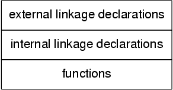

Specialized areas
=================

Government Health Warning
-------------------------

The previous chapters have introduced the fundamentals of the language
and have covered nearly all of the language that the
Standard defines. There are a number of murky and convoluted
backwaters left unexplored on grounds of sympathy and compassion for
the sufferer, and some without any better home. This chapter
gathers them together—it's the toxic waste dump for the nasty
bits of C.

Pull on your rubber gloves, read the
following sections and make notes where you think the material
is important to you; re-read them from time to time
as well. What seemed uninteresting and painful the first time
round may change as your experience grows, or your natural
immunity improves.

What we cover here is not an exhumation
of all the pathogenic elements—we leave that for another book—but
it does serve to round up most of the commonly
encountered difficult or extraordinary material.

Declarations, Definitions and Accessibility
-------------------------------------------

Chapter 4 introduced the concepts of scope and linkage, showing
how they can be combined to control the accessibility of
things throughout a program. We deliberately gave a vague description
of exactly what constitutes a definition on the grounds that
it would give you more pain than gain at that
stage. Eventually it has to be spelled out in detail,
which we do in this chapter. Just to make things
interesting, we need to throw in storage class too.

You'll probably find the interactions between these various elements to
be both complex and confusing: that's because they are! We
try to eliminate some of the confusion and give some
useful rules of thumb in Section 8.2.5 below—but to understand
them, you still need to read the stuff in between
at least once.

For a full understanding, you need a good grasp of
three distinct but related concepts. The Standard calls them:

    duration

    scope

    linkage

and describes what they mean in a fairly readable way
(for a standard). Scope and linkage have already been described
in Chapter 4, although we do present a review of them below.

8.2.1. Storage class specifiers

There are five keywords under the category of storage class
specifiers, although one of them, typedef, is there more out
of convenience than utility; it has its own section later
since it doesn't really belong here. The ones remaining are
auto, extern, register, and static.

Storage class specifiers help you to specify the type of
storage used for data objects. Only one storage class specifier
is permitted in a declaration—this makes sense, as there is
only one way of storing things—and if you omit the
storage class specifier in a declaration, a default is chosen.
The default depends on whether the declaration is made outside
a function (external declarations) or inside a function (internal declarations).
For external declarations the default storage class specifier will be
extern and for internal declarations it will be auto. The
only exception to this rule is the declaration of functions,
whose default storage class specifier is always extern.

The positioning of a declaration, the storage class specifiers used
(or their defaults) and, in some cases, preceding declarations of
the same name, can all affect the linkage of a
name, although fortunately not its scope or duration. We will
investigate the easier items first.

8.2.1.1. Duration

The duration of an object describes whether
its storage is allocated once only, at program start-up, or
is more transient in its nature, being allocated and freed
as necessary.

There are only two types of duration of objects: static
duration and automatic duration. Static duration means that the object
has its storage allocated permanently, automatic means that the storage
is allocated and freed as necessary. It's easy to tell
which is which: you only get automatic duration if ::

    the declaration is inside a function

    and the declaration does not contain the static or extern keywords

    and the declaration is not the declaration of a function

(if you work through the rules, you'll find that the
formal parameters of a function always meet all three requirements—they
are always ‘automatic’).

Although the presence of static in a declaration unambiguously ensures
that it has static duration, it's interesting to see that
it is by no means the only way. This is
a notorious source of confusion, but we just have to accept it.

Data objects declared inside functions are given the default storage
class specifier of auto unless some other storage class specifier
is used. In the vast majority of cases, you don't
want these objects to be accessible from outside the function,
so you want them to have no linkage. Either the
default, auto, or the explicit register storage class specifier results
in an object with no linkage and automatic duration. Neither
auto nor register can be applied to a declaration that
occurs outside a function.

The register storage class is quite interesting, although it is
tending to fall into disuse nowadays. It suggests to the
compiler that it would be a good idea to store
the object in one or more hardware registers in the
interests of speed. The compiler does not have to take
any notice of this, but to make things easy for
it, register variables do not have an address (the &
address-of operator is forbidden) because some computers don't support the
idea of addressable registers. Declaring too many register objects may
slow the program down, rather than speed it up, because
the compiler may either have to save more registers on
entrance to a function, often a slow process, or there
won't be enough registers remaining to be used for intermediate
calculations. Determining when to use registers will be a machine-specific
choice and should only be taken when detailed measurements show
that a particular function needs to be speeded up. Then
you will have to experiment. In our opinion, you should
never declare register variables during program development. Get the program
working first, then measure it, then, maybe, judicious use of
registers will give a useful increase in performance. But that
work will have to be repeated for every type of
processor you move the program to; even within one family
of processors the characteristics are often different.

A final note on register variables: this is the only
storage class specifier that may be used in a function
prototype or function definition. In a function prototype, the storage
class specifier is simply ignored, in a function definition it
is a hint that the actual parameter should be stored
in a register if possible. This example shows how it
might be used:

.. literalinclude:: ../src/example8.1/src/example8.1.c
   :language: c
   :linenos:

Example 8.1

So, the duration of an object depends on the storage
class specifier used, whether it's a data object or function,
and the position (block or file scope) of the declaration
concerned. The linkage is also dependent on the storage class
specifier, what kind of object it is and the scope
of the declaration. Table 8.1 and Table 8.2 show the
resulting storage duration and apparent linkage for the various combinations
of storage class specifiers and location of the declaration. The
actual linkage of objects with static duration is a bit
more complicated, so use these tables only as a guide
to the simple cases and take a look at what
we say later about definitions.

+-------------------------+-------------------------+-------------------------+--------------------------+
|Storage Class Specifier  | Function or Data Object |     Linkage             |   Duration               |
+=========================+=========================+=========================+==========================+
| static                  | either 	            | internal                | static                   |
+-------------------------+-------------------------+-------------------------+--------------------------+
| extern                  | either 	            | probably external       | static                   |
+-------------------------+-------------------------+-------------------------+--------------------------+
| none 	                  | function                | probably external       | static                   |
+-------------------------+-------------------------+-------------------------+--------------------------+
| none 	                  | data object             | external                | static                   |
+-------------------------+-------------------------+-------------------------+--------------------------+

Table 8.1. External declarations (outside a function)

The table above omits the register and auto storage class
specifiers because they are not permitted in file-scope (external) declarations.

+-------------------------------+-------------------------------+-------------------+-------------+
|Storage Class Specifier 	|Function or Data Object 	|Linkage 	    |Duration     |
+===============================+===============================+===================+=============+
|register                       |data object only               |none               |automatic    |
+-------------------------------+-------------------------------+-------------------+-------------+
|auto                           |data object only               |none               |automatic    |
+-------------------------------+-------------------------------+-------------------+-------------+
|static                         |data object only 	        |none               |static       |
+-------------------------------+-------------------------------+-------------------+-------------+
|extern                         |either                         |probably external  |static       |
+-------------------------------+-------------------------------+-------------------+-------------+
|none 	                        |data object                    |none               |automatic    |
+-------------------------------+-------------------------------+-------------------+-------------+
|none 	                        |function                       |probably external  |static       |
+-------------------------------+-------------------------------+-------------------+-------------+

Table 8.2. Internal declarations|

Internal static variables retain their values between calls of the
function that contains them, which is useful in certain circumstances
(see Chapter 4).

8.2.2. Scope

Now we must look again at the scope of the
names of objects, which defines when and where a given
name has a particular meaning. The different types of scope are the following: ::

    function scope

    file scope

    block scope

    function prototype scope

The easiest is function scope. This only applies to labels,
whose names are visible throughout the function where they are
declared, irrespective of the block structure. No two labels in
the same function may have the same name, but because
the name only has function scope, the same name can
be used for labels in every function. Labels are not
objects—they have no storage associated with them and the concepts
of linkage and duration have no meaning for them.

Any
name declared outside a function has file scope, which means
that the name is usable at any point from the
declaration on to the end of the source code file
containing the declaration. Of course it is possible for these
names to be temporarily hidden by declarations within compound statements.
As we know, function definitions must be outside other functions,
so the name introduced by any function definition will always
have file scope.

A name declared inside a compound statement, or as a
formal parameter to a function, has block scope and is
usable up to the end of the associated } which
closes the compound statement. Any declaration of a name within
a compound statement hides any outer declaration of the same
name until the end of the compound statement.

A special and rather trivial example of scope is function
prototype scope where a declaration of a name extends only
to the end of the function prototype. That means simply
that this is wrong (same name used twice):

.. code-block:: C

    void func(int i, int i);

and this is all right:

.. code-block:: C

    void func(int i, int j);

The names declared inside the parentheses disappear outside them.

The scope of a name is completely independent of any
storage class specifier that may be used in its declaration.

8.2.3. Linkage

We will briefly review the subject of linkage here, too.
Linkage is used to determine what makes the same name
declared in different scopes refer to the same thing. An
object only ever has one name, but in many cases
we would like to be able to refer to the
same object from different scopes. A typical example is the
wish to be able to call printf from several different
places in a program, even if those places are not
all in the same source file.

The Standard warns that declarations which refer to the same
thing must all have compatible type, or the behaviour of
the program will be undefined. A full description of compatible
type is given later; for the moment you can take
it to mean that, except for the use of the
storage class specifier, the declarations must be identical. It's the
responsibility of the programmer to get this right, though there
will probably be tools available to help you check this out.

The three different types of linkage are: ::

    external linkage

    internal linkage

    no linkage

In an entire program, built up perhaps from a number
of source files and libraries, if a name has external
linkage, then every instance of a that name refers to
the same object throughout the program.

For something which has
internal linkage, it is only within a given source code
file that instances of the same name will refer to
the same thing.

Finally, names with no linkage refer to
separate things.

8.2.4. Linkage and definitions

Every data object or function that is actually used in
a program (except as the operand of a sizeof operator)
must have one and only one corresponding definition. This is
actually very important, although we haven't really come across it
yet because most of our examples have used only data
objects with automatic duration, whose declarations are axiomatically definitions, or
functions which we have defined by providing their bodies.

This
‘exactly one’ rule means that for objects with external linkage
there must be exactly one definition in the whole program;
for things with internal linkage (confined to one source code
file) there must be exactly one definition in the file
where it is declared; for things with no linkage, whose
declaration is always a definition, there is exactly one definition
as well.

Now we try to draw everything together. The real questions are

    How do I get the sort of linkage that I want?

    What actually constitutes a definition?

We need to look into linkage first, then definitions.

How
do you get the appropriate linkage for a particular name?
The rules are a little complicated.

    A declaration outside a function (file scope) which contains the static storage class specifier results in internal linkage for that name. (The Standard requires that function declarations which contain static must be at file scope, outside any block)

    If a declaration contains the extern storage class specifier, or
    is the declaration of a function with no storage class
    specifier (or both), then:

        If there is already a visible declaration of that identifier
        with file scope, the resulting linkage is the same as
        that of the visible declaration;

        otherwise the result is external linkage.

    If a file scope declaration is neither the declaration of
    a function nor contains an explicit storage class specifier, then
    the result is external linkage.

    Any other form of declaration results in no linkage.

    In any one source code file, if a given identifer
    has both internal and external linkage then the result is
    undefined.

These rules were used to derive the ‘linkage’ columns of
Table 8.1 and Table 8.2, without the full application of
rule 2—hence the use of the ‘probably external’ term. Rule
2 allows you to determine the precise linkage in those cases.

What makes a declaration into a definition?

    Declarations that result in no linkage are also definitions.

    Declarations that include an initializer are always definitions; this includes
    the ‘initialization’ of functions by providing their body. Declarations with
    block scope may only have initializers if they also have
    no linkage.

    Otherwise, the declaration of a name with file scope and
    with either no storage class specifier or with the static
    storage class specifier is a tentative definition. If a source
    code file contains one or more tentative definitions for an
    object, then if that file contains no actual definitions, a
    default definition is provided for that object as if it
    had an initializer of 0. (Structures and arrays have all
    their elements initialized to 0). Functions do not have tentative
    definitions.

A consequence of the foregoing is that unless you also
provide an initializer, declarations that explicitly include the extern storage
class specifier do not result in a definition.

8.2.5. Realistic use of linkage and definitions

The rules that determine the linkage and definition associated with
declarations look quite complicated. The combinations used in practice are
nothing like as bad; so let's investigate the usual cases.

The three types of accessibility that you will want of
data objects or functions are: ::

    throughout the entire program,

    restricted to one source file,

    restricted to one function (or perhaps a single compound statement).

For the three cases above, you will want external linkage,
internal linkage, and no linkage respectively. The recommended practice for
the first two cases is to declare all of the
names in each of the relevant source files before you
define any functions. The recommended layout of a source file
would be as shown in Figure 8.1.

Diagram showing the typical layout of a C source file,
starting with external linkage declarations, which are followed by internal
linkage declarations, and then functions at the end.

    Figure 8.1. Layout of a source file

The external linkage declarations would be prefixed with extern, the
internal linkage declarations with static. Here's an example.

.. literalinclude:: ../src/example8.2/src/example8.2.c
   :language: c
   :linenos:

Example 8.2

We suggest that your re-read the preceding sections to see
how the rules have been applied in Example 8.2.

Typedef
-------

Although typedef is thought of as being a storage class,
it isn't really. It allows you to introduce synonyms for
types which could have been declared some other way. The
new name becomes equivalent to the type that you wanted,
as this example shows.

.. code-block:: C

    typedef int aaa, bbb, ccc;
    typedef int ar[15], arr[9][6];
    typedef char c, *cp, carr[100];

    /* now declare some objects */

    /* all ints */
    aaa     int1;
    bbb     int2;
    ccc     int3;

    ar      yyy;    /* array of 15 ints */
    arr     xxx;    /* 9*6 array of int */

    c       ch;     /* a char */
    cp      pnt;    /* pointer to char */
    carr    chry;   /* array of 100 char */

The general rule with the use of typedef is to
write out a declaration as if you were declaring variables
of the types that you want. Where a declaration would
have introduced names with particular types, prefixing the whole thing
with typedef means that, instead of getting variables declared, you
declare new type names instead. Those new type names can
then be used as the prefix to the declaration of
variables of the new type.

The use of typedef isn't a particularly common sight in
most programs; it's typically found only in header files and
is rarely the province of day-to-day coding.

It is sometimes found in applications requiring very high portability:
there, new types will be defined for the basic variables
of the program and appropriate typedefs used to tailor the
program to the target machine. This can lead to code
which C programmers from other environments will find difficult to
interpret if it's used to excess. The flavour of it
is shown below:

.. code-block:: C

    /* file 'mytype.h' */
    typedef short   SMALLINT        /* range *******30000 */
    typedef int     BIGINT          /* range ******* 2E9 */

    /* program */
    #include "mytype.h"

    SMALLINT        i;
    BIGINT          loop_count;

On some machines, the range of an int would not
be adequate for a BIGINT which would have to be
re-typedef'd to be long.

To re-use a name already declared as a typedef, its
declaration must include at least one type specifier, which removes
any ambiguity:

.. code-block:: C

    typedef int new_thing;
    func(new_thing x){
            float new_thing;
            new_thing = x;
    }

As a word of warning, typedef can only be used
to declare the type of return value from a function,
not the overall type of the function. The overall type
includes information about the function's parameters as well as the
type of its return value.

.. code-block:: C

    /*
    * Using typedef, declare 'func' to have type
    * 'function taking two int arguments, returning int'
    */
    typedef int func(int, int);

    /* ERROR */
    func func_name{ /*....*/ }

    /* Correct. Returns pointer to a type 'func' */
    func *func_name(){ /*....*/ }

    /*
    * Correct if functions could return functions,
    * but C can't.
    */
    func func_name(){ /*....*/ }

If a typedef of a particular identifier is in scope,
that identifer may not be used as the formal parameter
of a function. This is because something like the following
declaration causes a problem:

.. code-block:: C

    typedef int i1_t, i2_t, i3_t, i4_t;

    int f(i1_t, i2_t, i3_t, i4_t)/*THIS IS POINT 'X'*/

A compiler reading the function declaration reaches point ‘X’ and
still doesn't know whether it is looking at a function
declaration, essentially similar to

.. code-block:: C

    int f(int, int, int, int) /* prototype */

or

.. code-block:: C

    int f(a, b, c, d) /* not a prototype */

—the problem is only resolvable (in the worst case) by
looking at what follows point ‘X’; if it is a
semicolon, then that was a declaration, if it is a
{ then that was a definition. The rule forbidding typedef
names to be formal parameters means that a compiler can
always tell whether it is processing a declaration or a
definition by looking at the first identifier following the function
name.

The use of typedef is also valuable when you
want to declare things whose declaration syntax is painfully impenetrable,
like ‘array of ten pointers to array of five integers’,
which tends to cause panic even amongst the hardy. Hiding
it in a typedef means you only have to read
it once and can also help to break it up into manageable pieces:

.. code-block:: C

    typedef int (*a10ptoa5i[10])[5];
    /* or */
    typedef int a5i[5];
    typedef a5i *atenptoa5i[10];

Try it out!

Const and volatile
------------------

These are new in Standard C, although the idea of
const has been borrowed from C++. Let us get one
thing straight: the concepts of const and volatile are completely
independent. A common misconception is to imagine that somehow const
is the opposite of volatile and vice versa. They are
unrelated and you should remember the fact.

Since const declarations are the simpler, we'll look at them
first, but only after we have seen where both of
these type qualifiers may be used. The complete list of
relevant keywords is

char      long      float     volatile
short     signed    double    void
int       unsigned  const

In that list, const and volatile are type qualifiers, the
rest are type specifiers. Various combinations of type specifiers are permitted:

char, signed char, unsigned char
int, signed int, unsigned int
short int, signed short int, unsigned short int
long int, signed long int, unsigned long int
float
double
long double

A few points should be noted. All declarations to do
with an int will be signed anyway, so signed is
redundant in that context. If any other type specifier or
qualifier is present, then the int part may be dropped,
as that is the default.

The keywords const and volatile can be applied to any
declaration, including those of structures, unions, enumerated types or typedef
names. Applying them to a declaration is called qualifying the
declaration—that's why const and volatile are called type qualifiers, rather
than type specifiers. Here are a few representative examples:

.. code-block:: C

    volatile i;
    volatile int j;
    const long q;
    const volatile unsigned long int rt_clk;
    struct{
            const long int li;
            signed char sc;
    }volatile vs;

Don't be put off; some of them are deliberately complicated:
what they mean will be explained later. Remember that they
could also be further complicated by introducing storage class specifications
as well! In fact, the truly spectacular

.. code-block:: C

    extern const volatile unsigned long int rt_clk;

is a strong possibility in some real-time operating system kernels.

8.4.1. Const

Let's look at what is meant when const is used.
It's really quite simple: const means that something is not
modifiable, so a data object that is declared with const
as a part of its type specification must not be
assigned to in any way during the run of a
program. It is very likely that the definition of the
object will contain an initializer (otherwise, since you can't assign
to it, how would it ever get a value?), but
this is not always the case. For example, if you
were accessing a hardware port at a fixed memory address
and promised only to read from it, then it would
be declared to be const but not initialized.

Taking the address of a data object of a type
which isn't const and putting it into a pointer to
the const-qualified version of the same type is both safe
and explicitly permitted; you will be able to use the
pointer to inspect the object, but not modify it. Putting
the address of a const type into a pointer to
the unqualified type is much more dangerous and consequently prohibited
(although you can get around this by using a cast).
Here is an example:

.. literalinclude:: ../src/example8.3/src/example8.3.c
   :language: c
   :linenos:

Example 8.3

As the example shows, it is possible to take the
address of a constant object, generate a pointer to a
non-constant, then use the new pointer. This is an error
in your program and results in undefined behaviour.

The main intention of introducing const objects was to allow
them to be put into read-only store, and to permit
compilers to do extra consistency checking in a program. Unless
you defeat the intent by doing naughty things with pointers,
a compiler is able to check that const objects are
not modified explicitly by the user.

An interesting extra feature pops up now. What does this mean?

.. code-block:: C

    char c;
    char *const cp = &c;

It's simple really; cp is a pointer to a char,
which is exactly what it would be if the const
weren't there. The const means that cp is not to
be modified, although whatever it points to can be—the pointer
is constant, not the thing that it points to. The
other way round is

.. code-block:: C

    const char *cp;

which means that now cp is an ordinary, modifiable pointer,
but the thing that it points to must not be
modified. So, depending on what you choose to do, both
the pointer and the thing it points to may be
modifiable or not; just choose the appropriate declaration.

8.4.2. Volatile

After const, we treat volatile. The reason for having this
type qualifier is mainly to do with the problems that
are encountered in real-time or embedded systems programming using C.
Imagine that you are writing code that controls a hardware
device by placing appropriate values in hardware registers at known
absolute addresses.

Let's imagine that the device has two registers, each 16
bits long, at ascending memory addresses; the first one is
the control and status register (csr) and the second is
a data port. The traditional way of accessing such a
device is like this:

.. literalinclude:: ../src/example8.4/src/example8.4.c
   :language: c
   :linenos:

Example 8.4

The technique of using a structure declaration to describe the
device register layout and names is very common practice. Notice
that there aren't actually any objects of that type defined,
so the declaration simply indicates the structure without using up
any store.

To access the device registers, an appropriately cast constant is
used as if it were pointing to such a structure,
but of course it points to memory addresses instead.

However, a major problem with previous C compilers would be
in the while loop which tests the status register and
waits for the ERROR or READY bit to come on.
Any self-respecting optimizing compiler would notice that the loop tests
the same memory address over and over again. It would
almost certainly arrange to reference memory once only, and copy
the value into a hardware register, thus speeding up the
loop. This is, of course, exactly what we don't want;
this is one of the few places where we must
look at the place where the pointer points, every time
around the loop.

Because of this problem, most C compilers have been unable
to make that sort of optimization in the past. To
remove the problem (and other similar ones to do with
when to write to where a pointer points), the keyword
volatile was introduced. It tells the compiler that the object
is subject to sudden change for reasons which cannot be
predicted from a study of the program itself, and forces
every reference to such an object to be a genuine reference.

Here is how you would rewrite the example, making use
of const and volatile to get what you want.

.. literalinclude:: ../src/example8.5/src/example8.5.c
   :language: c
   :linenos:

Example 8.5

The rules about mixing volatile and regular types resemble those
for const. A pointer to a volatile object can be
assigned the address of a regular object with safety, but
it is dangerous (and needs a cast) to take the
address of a volatile object and put it into a
pointer to a regular object. Using such a derived pointer
results in undefined behaviour.

If an array, union or structure is declared with const
or volatile attributes, then all of the members take on
that attribute too. This makes sense when you think about
it—how could a member of a const structure be modifiable?

That means that an alternative rewrite of the last example
would be possible. Instead of declaring the device registers to
be volatile in the structure, the pointer could have been
declared to point to a volatile structure instead, like this:

.. code-block:: C

    struct devregs{
          unsigned short  csr;    /* control & status */
          unsigned short  data;   /* data port */
    };
    volatile struct devregs *const dvp=DEVADDR+devno;

Since dvp points to a volatile object, it not permitted
to optimize references through the pointer. Our feeling is that,
although this would work, it is bad style. The volatile
declaration belongs in the structure: it is the device registers
which are volatile and that is where the information should
be kept; it reinforces the fact for a human reader.

So, for any object likely to be subject to modification
either by hardware or asynchronous interrupt service routines, the volatile
type qualifier is important.

Now, just when you thought that you understood all that,
here comes the final twist. A declaration like this:

.. code-block:: C

    volatile struct devregs{
          /* stuff */
    }v_decl;

declares the type struct devregs and also a volatile-qualified object
of that type, called v_decl. A later declaration like this

.. code-block:: C

    struct devregs nv_decl;

declares nv_decl which is not qualified with volatile! The qualification
is not part of the type of struct devregs but
applies only to the declaration of v_decl. Look at it
this way round, which perhaps makes the situation more clear
(the two declarations are the same in their effect):

.. code-block:: C

    struct devregs{
          /* stuff */
    }volatile v_decl;

If you do want to get a shorthand way of attaching a
qualifier to another type, you can use typedef to do it:

.. code-block:: C

    struct x{
          int a;
    };
    typedef const struct x csx;

    csx const_sx;
    struct x non_const_sx = {1};

    const_sx = non_const_sx;        /* error - attempt to modify a const */

8.4.2.1. Indivisible Operations

Those of you who are familiar with techniques that involve hardware
interrupts and other ‘real time’ aspects of programming will recognise the
need for volatile types. Related to this area is the need
to ensure that accesses to data objects are ‘atomic’, or uninterruptable.
To discuss this is any depth would take us beyond the
scope of this book, but we can at least outline some
of the issues.

Be careful not to assume that any operations
written in C are uninterruptable. For example,

.. code-block:: C

    extern const volatile unsigned long realtimeclock;

could be a counter which is updated by a clock interrupt
routine. It is essential to make it volatile because of the
asynchronous updates to it, and it is marked const because it
should not be changed by anything other than the interrupt routine.
If the program accesses it like this:

.. code-block:: C

    unsigned long int time_of_day;

    time_of_day = real_time_clock;

there may be a problem. What if, to copy one long
into another, it takes several machine instructions to copy the two
words making up real_time_clock and time_of_day? It is possible that an
interrupt will occur in the middle of the assignment and that
in the worst case, when the low-order word of real_time_clock is
0xffff and the high-order word is 0x0000, then the low-order word
of time_of_day will receive 0xffff. The interrupt arrives and increments the
low-order word of real_time_clock to 0x0 and then the high-order word
to 0x1, then returns. The rest of the assignment then completes,
with time_of_day ending up containing 0x0001ffff and real_time_clock containing the correct
value, 0x00010000.

This whole class of problem is what is known as a
critical region, and is well understood by those who regularly work
in asynchronous environments. It should be understood that Standard C takes
no special precautions to avoid these problems, and that the usual
techniques should be employed.

The header ‘signal.h’ declares a type called sig_atomic_t which is guaranteed
to be modifiable safely in the presence of asynchronous events. This
means only that it can be modified by assigning a value
to it; incrementing or decrementing it, or anything else which produces
a new value depending on its previous value, is not safe.

Sequence points
---------------

Associated with, but distinct from, the problems of real-time programming are
sequence points. These are the Standard's attempt to define when certain
sorts of optimization may and may not be permitted to be
in effect. For example, look at this program:

.. literalinclude:: ../src/example8.6/src/example8.6.c
   :language: c
   :linenos:

Example 8.6

The compiler might want to optimize the loop so that i_var
can be stored in a machine register for speed. However, the
function needs to have access to the correct value of i_var
so that it can print the right value. This means that
the register must be stored back into i_var at each function
call (at least). When and where these conditions must occur are
described by the Standard. At each sequence point, the side effects
of all previous expressions will be completed. This is why you
cannot rely on expressions such as:

.. code-block:: C

    a[i] = i++;

because there is no sequence point specified for the assignment, increment
or index operators, you don't know when the effect of the
increment on i occurs.

The sequence points laid down in the Standard are the following:

    The point of calling a function, after evaluating its arguments.

    The end of the first operand of the && operator.

    The end of the first operand of the || operator.

    The end of the first operand of the ?: conditional operator.

    The end of the each operand of the comma operator.

    Completing the evaluation of a full expression. They are the following:

        Evaluating the initializer of an auto object.

        The expression in an ‘ordinary’ statement—an expression followed by semicolon.

        The controlling expressions in do, while, if, switch or for statements.

        The other two expressions in a for statement.

        The expression in a return statement.

Summary
-------

This is a chapter describing specialized areas of the language.

Undoubtedly,
the issues of scope, linkage and duration are important. If you
find the whole topic too much to digest, just learn the
simple rules. The problem is that the Standard tries to be
complete and unambiguous, so it has to lay down lots of
rules. It's much easier if you just stick to the easy
way of doing things and don't try to get too clever.
Use Example 8.2 as a model if in doubt.

The use
of typedef depends on your level of experience. Its most common
use is to help avoid some of the more unpleasant aspects
of complicated type declarations.

The use of const will be widespread
in many programs. The idea of a pointer to something which
is not modifiable is well and truly emphasized in the library
function prototypes.

Only specialized applications will use volatile. If you work
in the field of real-time programming, or embedded systems, this will
matter to you. Otherwise it probably won't. The same goes for
sequence points. How well the early compilers will support these last
two features will be a very interesting question.
